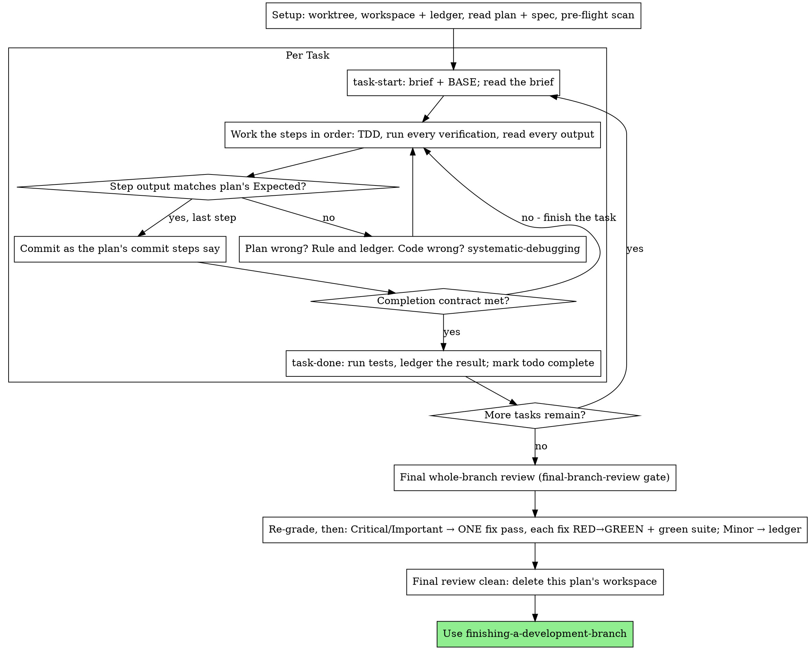

# Executing Plans

**Placeholder resolution:** `<KEY>` placeholders in this file (such as `<BASE_BRANCH>`) resolve from the `Herdrpowers Configuration` section of the repository's `CLAUDE.md` / `AGENTS.md`. If that section is missing, initialize it with the pack's init workflow (`/herdrpowers:init` on Claude Code plugin installs; `commands/init.md` otherwise).

Execute the plan yourself, task by task, in this session: no implementer
pane per task, no reviewer per task. One fresh-session review of the whole
branch at the end.

**Why inline:** Pane-driven development pays for a fresh implementer and
fresh reviewers on every task, each re-reading the codebase from zero.
Inline execution pays for one session (yours) plus one review at the end.
What it gives up is a fresh session per task and a second pair of eyes per
task. This skill keeps what those two things bought, by other means: the
brief is the spec, the ledger is your memory, TDD is the per-task gate, and
the final review is the second pair of eyes.

**Inline overrides the work routes, never the review gate.** Every task,
test, and fix in this plan runs here, whatever `complex-coding`,
`simple-coding`, `test-authoring`, `review-fixes`, or `chores` resolve to in
the merged configuration (`.herdrpowers/config.yaml` over
`orchestration/roles.yaml`) — that is what inline means. The final review
still resolves from `assignments.final-branch-review`.

**Core principle:** The plan already did the thinking. Execute it exactly,
prove each step with a test you watched fail and then pass, and leave a
record that survives your own forgetting.

**Narration:** between tool calls, narrate at most one short line — the
ledger and the tool results carry the record.

**Continuous execution:** Do not pause to check in with your human partner
between tasks. Inline execution exists to spend less, not to ask "should I
continue?" after every task. Execute all tasks from the plan without
stopping.

**Rulings, not stalls.** Conflicts, ambiguities, plan defects — decide them.
The spec is the binding authority, the plan is its argument, and your
judgment settles what neither answers. Record every decision in the ledger
as `Ruling: <what you decided> — <why> — <what it costs if wrong>`, and keep
going. Deviating from the plan without a ledgered ruling is a decision made
in secret.

Four things stop you, and only these: an irreversible or destructive
operation; a security-sensitive action; a side effect outside this worktree
that norms say you ask about first (a merge, a push to a shared branch, a
publish); and a plan so broken that every path forward is a guess. For
those, stop and ask.

**A ruling never rewrites the run's terms.** It resolves what the spec and
the plan left open — it does not re-enable a gate the repository disabled,
disable one it enabled, widen `delegation.pane_scope`, or touch
`.herdrpowers/config.yaml`. Those are the user's declaration, resolved once
at start.

## When to Use

- You have a plan from writing-plans and your human partner chose inline
  execution at the handoff.
- No herdr sibling pane can take the work: `HERDR_ENV` is unset, or no
  idle agent pane exists inside `delegation.pane_scope`. Never fabricate a
  delegation; run the plan here.
- Tasks are mostly independent — the same precondition as
  pane-driven-development.

A fully specified plan makes inline execution transcription plus testing:
it runs well on a mid-tier session model, and the one place a fresh session
earns its cost is the final review, which this skill sends out separately.
Tell your human partner so when they choose inline.

Prefer pane-driven-development when your human partner wants a review gate
on every task, or when the plan is long enough that its later tasks would
run on a compacted context. Inline execution over a long plan still works —
the ledger is what makes it recoverable — but the last tasks get the least
of you.

**Inside a workflow** (`/execute`, `/full_cycle`, and the rest, degrading to
inline), run Setup and the Task Loop here, then return to the workflow: its
documentation, verification, and final-review steps follow in its own
order. When its final-review step comes, run it as this skill's Final
Review describes, and put Finish's lists in the workflow's final report.

## The Process



## Setup

Ensure the work happens in an isolated workspace: use using-git-worktrees
to create one or verify the existing one. Never start implementation on
`<BASE_BRANCH>` (or main/master) without your human partner's explicit
consent.

Conversation memory does not survive compaction. An inline executor that
loses its place re-implements tasks whose commits already exist — the same
failure as an orchestrator re-delegating them, paid for in your own
context. Track progress in a ledger file, not only in todos. Harness todos
are a live view; the ledger is the record.

The workspace and ledger are shared with pane-driven-development — same
directory, same format — so a plan can change executors mid-flight and the
new one resumes from the same ledger.

- Each plan owns a workspace: at skill start, run
  `bash ../pane-driven-development/scripts/pdd-workspace PLAN_FILE` — it
  prints the plan's git-ignored directory (under
  `<repo-root>/.herdrpowers/pdd/`), home to every artifact for THIS plan:
  ledger, briefs, review packages. Another plan's directory is never yours
  to read or write.
- Check for this plan's ledger at `<workspace>/progress.md`. If its first
  line names your plan file, tasks with a `Task <N>: complete` line are
  DONE — do not redo them; resume at the first task without one. Their
  commits exist in git even when your context no longer remembers making
  them: after compaction, trust the ledger and `git log` over your own
  recollection. A ledger whose first line names a different plan file is
  another plan's progress: leave it and start your own, fresh.
- Create the ledger with its identity as the first line:
  `# PDD ledger — plan: <plan file path>`.
- `git clean -fdx` will destroy the workspace (it's git-ignored scratch);
  if that happens, recover from `git log`.

Read the plan once, note its context and Global Constraints, and create a
todo per task. If the plan names a Spec, read that too: the spec is the
authority the plan argues from, and conflicts inside the plan resolve
against it. A plan with no reachable spec gets a ledger note saying so —
rulings made without one are provisional. If a codegraph plugin/tool is
available, validate the plan's named files, symbols, and likely impact
surface with it; otherwise use ordinary repo search and file reads.

**REQUIRED SUB-SKILL:** load test-driven-development now, before Task 1.
It governs every step of every task below; a plan whose steps already say
"write the failing test first" does not exempt you from reading it.

Before Task 1, scan the plan for conflicts between tasks. The plan's
Interfaces blocks tell you where to look: for every task that consumes
what an earlier task produces, one ledger row — the two tasks, what one
produces against what the other consumes, and what you found. Tasks that
share nothing get no row; a plan whose tasks share nothing gets the single
line `Pre-flight: no shared interfaces`. Rule on each conflict a row
surfaces with the spec as the binding authority, record the ruling beside
its row, and start Task 1. Each task's own text is checked when you read
its brief, not here.

## The Task Loop

Everything you print, and every tool result, stays resident in your
context for the rest of the session. Redirect long test output to a file
in the workspace and read its tail; read a brief, not the whole plan.

### 1. Take the task

- Run this skill's `bash scripts/task-start PLAN_FILE N`. It prints the
  brief path and BASE (the commit the task's range is cut from) in one
  call. Read the brief for every task, including ones you remember from
  setup: what you remember is a summary, the brief has the exact values,
  signatures, and test cases.
- Mark the task's todo in_progress.

Every tool call is a turn that re-reads your whole context. Bookkeeping
rides along with work — a ledger append in the same call as the commit,
never in a call of its own.

### 2. Work the steps

The plan's steps are already in RED-GREEN order; follow them in that
order under test-driven-development, loaded at setup. A test step's code
is written first and run first. Watching it fail is a step, not a
formality — a test that passes before the implementation exists is a
finding about the test.

Every step that runs a command has an `Expected:` line. Run the command,
read its output, and compare. Three outcomes:

- **Matches.** Next step.
- **The code is wrong.** Use systematic-debugging. Find the cause; never
  patch the symptom to make the step's output match.
- **The plan is wrong** — a step contradicts the spec, an interface from an
  earlier task doesn't match what this task consumes, a command that
  cannot work. Rule on the smallest change that satisfies the spec, ledger
  it as `Task <N>: Ruling: <finding> — <what you decided and why>`, and
  continue. The ruling is carried, not remembered: later tasks that touch
  the same interface read it from the ledger.

Commit as the plan's commit steps say. A task that spans several commits
is fine; BASE is what the review range is cut from, never `HEAD~1`.

### 3. The completion contract

Before a task's ledger line, all of the following are true, with evidence
in this session — not inferred from the diff looking right:

- Every test the brief names exists and ran in this task, and you read
  the output.
- The final test run for the task passed — `task-done` is that run, and
  it writes the command and result into the ledger line.
- Every `Expected:` line in the brief was compared against real output.
- Every deviation from the brief has a `Ruling:` line in the ledger.

**REQUIRED SUB-SKILL:** verification-before-completion governs the claim.
If any item is missing, the task is not complete: finish it.

### 4. Complete the task

Run this skill's `bash scripts/task-done PLAN_FILE N BASE -- <test command>`
with the test command the brief names for the whole task. It runs the
tests, keeps the full output in the workspace, prints the tail, and — only
if they pass — appends the completion line to the ledger:

`Task <N>: complete (commits <base7>..<head7>, tests: <command> → <result>)`

A failing run records nothing; the task is not complete. When it records,
mark the todo complete and take the next task.

## Final Review

Skipped when `assignments.final-branch-review` is disabled — inside a
workflow, the gate is the workflow's. Write `Final review: disabled by
configuration` to the ledger, go straight to Finish, and say the branch is
unreviewed.

Run `bash ../pane-driven-development/scripts/review-package PLAN_FILE MERGE_BASE HEAD`
(MERGE_BASE = the commit the branch started from, e.g.
`git merge-base <BASE_BRANCH> HEAD`); the file it prints is the review's
diff.

**With a reviewer available:** request the review through
requesting-code-review — it resolves the gate's role and mode, picks the
reset-backed pane(s), and submits its
[review-brief.md](../requesting-code-review/review-brief.md) with the
package path. In `[PLAN_OR_REQUIREMENTS]`, give the plan and spec paths,
the plan's Review Focus section verbatim if it has one (the input classes
and failure modes the plan's tests do not exercise — the reviewer checks
each deliberately), and a pointer to the ledger's `Ruling:` lines so it can
weigh the calls you made. This is the one fresh session the whole run buys.
Do not skip it, and do not replace it with your own read of the diff.

**When no reviewer can take it** (typically outside herdr: no pane of the
gate's agent types in scope, and no substitute): read review-brief.md and
perform that review yourself against the package, as a separate pass after
the last task's ledger line. Write `Final review: self-review (no reviewer
available)` to the ledger, and say so in your final message: a self-review
by the author is not an independent review, and your human partner decides
whether that is enough before merge.

Sort the findings before you act on any of them. The reviewer's severity
labels are advice; the gate is yours. Its "Declined to judge" list is
yours too: every line there is a ruling you make and ledger, exactly like
a plan conflict — `Final: Ruling: <behavior the reviewer set aside> —
<what a reasonable person using this software gets, and why that stands
or why it is now a finding> — <cost if wrong>`. Re-grade first, by effect:
the spec is a vision document, and a finding's grade is what a reasonable
person using this software gets if it ships, not whether the spec names
the input that triggers it — a reviewer who set a finding at Minor
because the spec was silent has graded the spec, not the effect. Then:

- **Critical and Important** enter the fix pass.
- **Minor** goes to the ledger as `Final: minor (deferred): <one-liner>`
  and to your final message under "Deferred minors". Minors never enter
  the fix pass, and never become rulings — a ruling is a decision about a
  conflict, not a note that you declined a polish suggestion.

Fix the Critical and Important findings yourself — you are the
implementer here — in ONE pass. Each fix is verified by TDD, not by a
second reviewer: write the test that reproduces the finding, watch it
fail, make it pass, then run the whole suite. Record each in the ledger as
`Final: fixed <finding> — <test name> RED→GREEN, suite <N>/<N>`. A fix
without a test that failed first is not verified; a suite that is not
green after the pass means the pass is not over. Do not request a
re-review: it would re-read a diff whose covering tests already answer
"addressed" and whose suite run already answers "broke nothing".

A finding you decide not to fix is a ruling — `Final: Ruling: <finding> —
<why the code stands> — <cost if wrong>` — and reaches your human partner
in the rulings list. There is no second fix pass.

## Finish

Before you delete anything, collect every ledger line containing
`Ruling:` into your final message under "Rulings I made", in the order you
made them, each with what it costs if wrong, and every `minor (deferred)`
line under "Deferred minors". Both lists are exhaustive. Your final
message is the only place the decisions you took on your human partner's
behalf — and the findings you chose not to act on — reach them.

The same message names what inline execution gave up: no per-task review,
the tests written by this session (the pane that implemented them), and
how the final review ran — in a fresh session, as a self-review, or not at
all because the gate is disabled.

When the final review is clean and its fixes are committed, delete this
plan's workspace directory — the git history is the record now. Sibling
directories belong to other plans; leave them alone.

Use finishing-a-development-branch.

## Common Rationalizations

| Excuse | Reality |
|--------|---------|
| "I remember what Task N says" | You remember a summary. The brief has the exact values. Read it. |
| "The plan's code is right, skip watching the test fail" | A test you never saw fail proves nothing. It is one step. Run it. |
| "I'll run the full suite at the end instead of per step" | Per-step runs are how you learn which step broke it. The end-of-task run is the contract, not a substitute. |
| "The plan is wrong here, I'll just do the right thing" | Do the right thing and ledger the ruling. Unledgered deviation is a decision made in secret. |
| "I'll write the ledger lines after a few tasks" | Compaction does not wait for a convenient moment. One line per task, in the same message as the commit. |
| "Let me check in before the next task" | Inline exists to spend less. Progress prompts spend your human partner's time instead. Only the four stops stop you. |
| "I read my own diff carefully; the final reviewer is redundant" | Same author, same blind spots. The reviewer is the only fresh session this run buys. |
| "Tests should pass, the change was trivial" | "Should" is not evidence. The contract requires the command and its output. |
| "Panes are slow and expensive, I'll skip the final review too" | Inline already removed the per-task reviewers. One review of the whole branch is the floor, not the ceiling. |
| "The reviewer said Minor, so it's Minor" | The label graded the spec's silence. Grade what the person gets. Re-grade, then gate. |
| "The fix is obvious, no need for a failing test first" | The failing test is the only proof the finding was real and is now gone. Without it you have a diff and a hope. |
| "I'll fix the minors too while I'm in there" | Every minor you fix is a test, a fix, and a suite run your human partner did not ask for. Ledger them; they decide. |

## Example Workflow

```
You: I'm using the executing-plans skill to implement this plan inline.

[Setup: worktree verified]
[Read plan once: docs/herdrpowers/plans/feature-plan.md; spec read]
[Resolve workspace: bash ../pane-driven-development/scripts/pdd-workspace docs/herdrpowers/plans/feature-plan.md — no ledger inside, fresh start]
[Pre-flight scan: 2 shared-interface rows, clean; written to ledger]
[Create todos for all tasks]

Task 1: Hook installation script

[bash scripts/task-start plan 1 → brief read; BASE a1b2c3d]
[Step 1: write failing test — written]
[Step 2: run it — FAIL: install_hook not defined. Matches Expected.]
[Step 3: implement — written]
[Step 4: run it — PASS 1/1. Matches Expected.]
[Step 5: commit — d4e5f6a]
[Contract: tests ran, output read, no deviations]
[bash scripts/task-done plan 1 a1b2c3d -- npm test -- hooks → ledger: Task 1: complete (commits a1b2c3d..d4e5f6a, tests: npm test -- hooks → 1/1 pass)]

Task 2: Recovery modes

[bash scripts/task-start plan 2 → brief read; BASE d4e5f6a]
[Step 2: run failing test — FAIL, but on an import error: Task 1 exported
 installHook, brief consumes install_hook]
[Ruling: brief's consumer name is a typo against Task 1's Produces block;
 use installHook — Ledger: Task 2: Ruling: install_hook → installHook — matches Task 1 Produces — cost if wrong: one rename]
[Steps 2-5 as planned; commit b7c8d9e]
[bash scripts/task-done plan 2 d4e5f6a -- npm test -- recovery → ledger: Task 2: complete (commits d4e5f6a..b7c8d9e, tests: npm test -- recovery → 8/8 pass)]

...

[After all tasks: review-package plan MERGE_BASE HEAD; requesting-code-review → final-branch-review to the reviewer panes, reset-backed]
Reviewers: One Important finding — progress reporting interval hardcoded. Two Minor. Declined to judge: none.
[Re-grade: Important stands; minors → ledger as deferred]
[Fix pass: test_progress_interval_configurable RED → extract PROGRESS_INTERVAL → GREEN; suite 12/12; commit]
[Ledger: Final: fixed hardcoded interval — test_progress_interval_configurable RED→GREEN, suite 12/12]

Rulings I made:
- Task 2: install_hook → installHook (brief typo; cost if wrong: one rename)

Deferred minors:
- README lacks a usage example
- recovery.js could split verify/repair into two files

Inline execution: no per-task review; tests written by this session; final review by the reviewer panes in fresh sessions.

[Delete this plan's workspace — the record now lives in git]

Using finishing-a-development-branch.
```
