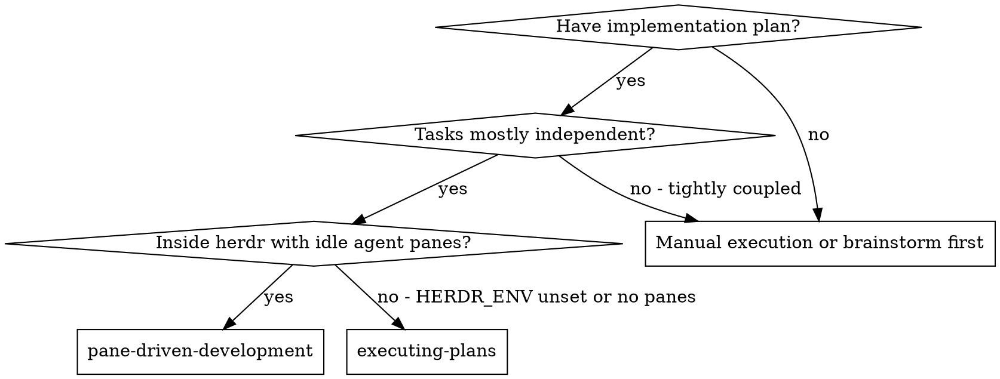
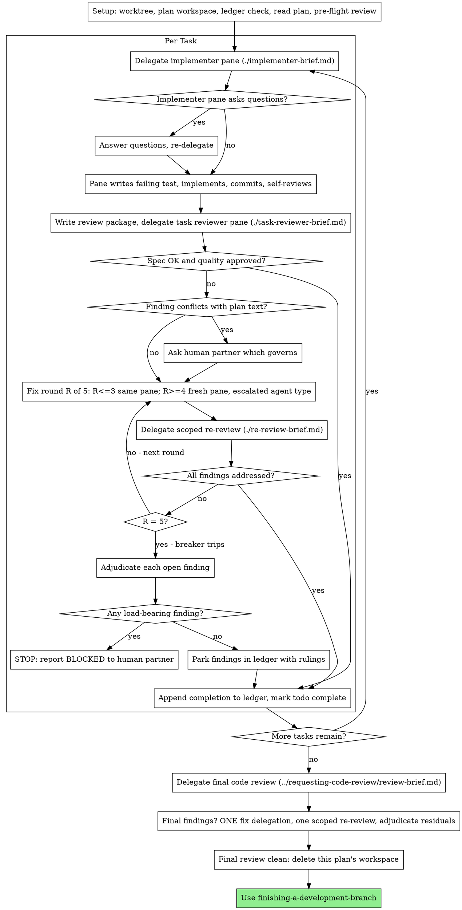

# Pane-Driven Development

**Placeholder resolution:** `<KEY>` placeholders in this file (such as `<BASE_BRANCH>` or `<REPORT_DIRECTORY>`) resolve from the `Herdrpowers Configuration` section of the repository's `CLAUDE.md` / `AGENTS.md`. If that section is missing, initialize it with the pack's init workflow (`/herdrpowers:init` on Claude Code plugin installs; `commands/init.md` otherwise).

## Delegation Model (READ FIRST)

Every task in this skill is delegated to a **herdr sibling agent pane**, never to an in-process subagent. The `orchestration` skill decides which role takes a task; `using-herdr-sibling-panes` is the transport that submits it and waits for the completion marker. Read both before delegating anything.

Two boundaries override anything below:

- **No in-process subagents.** Wherever this document says "dispatch," read "delegate to an idle sibling pane through `using-herdr-sibling-panes`." The Agent tool and named subagent types are not used by this pack.
- **The pane that writes tests owns RED-GREEN-REFACTOR.** By default (`test-authoring: {role: coder, mode: implementer}`) that is the implementing pane: it writes the failing test first per `test-driven-development` and reports RED/GREEN evidence, and independence comes from the reviewing pane auditing test code its author also implemented. A repo may reassign `test-authoring` to a separate pane — then the report must name which pane wrote the tests, because that pairing no longer holds. Review independence itself comes from the *fresh pane context* of the reviewing delegation, not from a named role, and is never configurable.

Execute the plan by delegating a fresh implementer pane per task, a task review (spec compliance + code quality) after each, and a broad whole-branch review at the end.

**Why panes:** a delegated pane starts from a reset session — it never inherits your context or history, so you construct exactly what it needs. That keeps it focused and preserves your own context for coordination work.

**Core principle:** Fresh pane per task + task review (spec + quality) + broad final review = high quality, fast iteration

**Narration:** between tool calls, narrate at most one short line — the ledger and the report files carry the record.

**Continuous execution:** Do not pause to check in with your human partner between tasks. Execute all tasks from the plan without stopping. The only reasons to stop are: BLOCKED status you cannot resolve, ambiguity that genuinely prevents progress, or all tasks complete.

## When to Use



**vs. Executing Plans (inline):**
- Fresh pane per task (no context pollution)
- Review after each task (spec compliance + code quality), broad review at the end
- Faster iteration (no human-in-loop between tasks)
- Requires `HERDR_ENV=1` and at least one idle sibling agent pane

## The Process



## Setup

Ensure the work happens in an isolated workspace: use `using-git-worktrees` to
create one or verify the existing one. Never start implementation on
`<BASE_BRANCH>` (or main/master) without your human partner's explicit consent.

Conversation memory does not survive compaction. In real sessions,
orchestrators that lost their place have re-delegated entire completed task
sequences — the single most expensive failure observed. Track progress in
a ledger file, not only in todos.

- Each plan owns a workspace: at skill start, run this skill's
  `scripts/pdd-workspace PLAN_FILE` — it prints the plan's git-ignored
  directory (`<repo-root>/.herdrpowers/pdd/<plan-basename>/`), home to
  every artifact for THIS plan: ledger, briefs, reports, review packages.
  Another plan's directory is never yours to read or write.
- Check for this plan's ledger at `<workspace>/progress.md`. If its first
  line names your plan file, tasks with a `Task <N>: complete` line are DONE
  — do not re-delegate them; resume at the first task without one. A task
  whose last line is a fix round is mid-loop: resume the loop at the next
  round. A ledger whose first line names a different plan file — or a stray
  ledger at the old flat path `.herdrpowers/pdd/progress.md` — is another
  plan's progress: leave it in place and start your own, fresh.
- Create the ledger with its identity as the first line:
  `# PDD ledger — plan: <plan file path>`.
- The ledger is your recovery map: the commits it names exist in git even
  when your context no longer remembers creating them. After compaction,
  trust the ledger and `git log` over your own recollection.
- `git clean -fdx` will destroy the workspace (it's git-ignored scratch); if
  that happens, recover from `git log`.

Read the plan once, note its context and Global Constraints, and create a
todo per task.

Before delegating Task 1, scan the plan once for conflicts:

- tasks that contradict each other or the plan's Global Constraints
- anything the plan explicitly mandates that the review rubric treats as a
  defect (a test that asserts nothing, verbatim duplication of a logic block)

Present everything you find to your human partner as one batched question —
each finding beside the plan text that mandates it, asking which governs —
before execution begins, not one interrupt per discovery mid-plan. If the
scan is clean, proceed without comment. The review loop remains the net for
conflicts that only emerge from implementation.

## Delegation Assignments

Routing is `orchestration`'s job, not this skill's. Resolve the whole
`assignments:` table at the start of execution from the merged configuration it
describes — `<repo-root>/.herdrpowers/config.yaml` first, then the pack's
`orchestration/roles.yaml` for anything the repo file omits. Resolve once, up
front; do not re-read per task.

Six tasks in that table drive this loop. The default column is what the pack
ships; the repo file may change any of it:

| Task | Default | Where it lands in this skill |
|---|---|---|
| `complex-coding` / `simple-coding` | coder / delegate | §1, the implementer delegation |
| `test-authoring` | coder / implementer | The implementing pane writes its own tests (`test-driven-development`) |
| `task-review` | coder / delegate | §3 |
| `review-fixes` | coder / implementer | §4 rounds 1-3 go back to the implementing pane |
| `fix-round-re-review` | coder / delegate | §4's scoped re-review |
| `chores` | generalist / delegate | Lookups, file moves, log gathering, mechanical edits found mid-plan |

Plan revisions stay with you, the orchestrator (`plan-and-design`).

Three configurations change the loop's shape:

- **`task-review` disabled** — skip §3 entirely. A task then completes on
  the implementing pane's own report: read it, resolve any concerns, and record
  the completion line. There is no fix loop to enter, because nothing produced
  findings. Name the disabled gate in your final report.
- **`fix-round-re-review` disabled** — a fix round ends when the fix
  report shows the covering tests, the command, and the output. The round still
  counts against the five-round cap, and the breaker still trips at five with
  whatever findings the fixing pane did not claim as fixed. Name the disabled
  gate in your final report.
- **`test-authoring: {mode: delegate}`** — tests go to a separate pane of that
  role instead of the implementing one. The implementer's brief then stops
  carrying RED-GREEN-REFACTOR ownership, and your report must name which pane
  wrote the tests, because the reviewer is no longer auditing test code its
  author also implemented.

The `final-branch-review` gate belongs to the calling workflow, not to this
skill: when it is disabled, skip the Final Review section below.

**Independence is not configurable.** With `task-review` on, the review always
goes to a pane that did not write the code, whatever the config says. And
`review-fixes` escalates at rounds 4-5 to a fresh pane regardless of its mode.

Panes are not reserved per role — pick any idle pane of the matching agent type at delegation time. When no pane of the right type is idle, wait; do not interrupt a working pane. When an agent type is exhausted (usage limit, or two markerless delegations on two panes of that type), take its substitute from the resolved `fallbacks:` map and name the fallback in your final report.

**Escalation is a type swap.** Panes have no model dial you control, so "try something stronger" means a different agent type: a fresh pane of another Coder-eligible type, or the substitute in `fallbacks:`. Use it when a pane reports BLOCKED for lack of reasoning, and at fix-loop rounds 4-5. Name the swap in the ledger line.

**Never delegate two implementation tasks into the same worktree at once.** One writer per working tree; that is the constraint parallelism has to respect, not the pane count.

## The Task Loop

Everything you paste into a delegation — and everything a pane prints back —
stays resident in your context for the rest of the session and is re-read on
every later turn. Hand artifacts over as files (see File Handoffs).

### 1. Delegate the implementer

Record BASE (`git rev-parse HEAD`) before delegating — the review package
and fix-round diffs need it.

Run `scripts/task-brief PLAN_FILE N` to extract the task's full text into the
plan workspace, then compose the delegation per
[implementer-brief.md](implementer-brief.md). Never make a pane read the whole
plan file. Exact values (numbers, magic strings, signatures, test cases)
appear only in the brief.

- If an earlier task parked a finding in the area this task touches, carry
  a pointer to that ledger entry in the delegation.
- Record the pane ID you delegated to — fix rounds 1-3 go back to that pane.

### 2. Handle the report

Implementer panes report one of four statuses. Handle each appropriately:

**DONE:** Generate the review package (`scripts/review-package PLAN_FILE BASE HEAD`, from this skill's directory — it prints the unique file path it wrote; BASE is the commit you recorded before delegating the task — never `HEAD~1`, which silently drops all but the last commit of a multi-commit task), then delegate the task review with the printed path.

**DONE_WITH_CONCERNS:** The pane completed the work but flagged doubts. Read the concerns before proceeding. If they are about correctness or scope, address them before review. If they are observations (e.g., "this file is getting large"), note them and proceed to review.

**NEEDS_CONTEXT:** The pane needs information that was not provided. Provide the missing context and re-delegate.

**BLOCKED:** The pane cannot complete the task. Assess the blocker with
`systematic-debugging` — root cause before fix, in the pane and in the
orchestrator:
1. If it is a context problem, provide more context and re-delegate to the same pane
2. If the task needs more reasoning, escalate the agent type (see Delegation Assignments)
3. If the task is too large, break it into smaller pieces
4. If the plan itself is wrong, escalate to the human

**No marker, no report:** that is not a status — it is a failed delegation. Diagnose it with `using-herdr-sibling-panes`' "Failure handling" table (crashed / blocked / interrupted / errored / exhausted) before re-delegating anything.

**Never** ignore an escalation or re-delegate the same task unchanged. If the pane said it is stuck, something needs to change.

If the pane asks questions — before starting or mid-task — answer clearly and
completely, provide additional context if needed, and don't rush it into
implementation.

### 3. Review the task

Skip this step when `assignments.task-review` is disabled (see Delegation
Assignments) — go straight to §5 with the pane's own report.

Per-task reviews are task-scoped gates. The broad review happens once, at the
final whole-branch review. Never skip the task review, and never accept a
report missing either verdict — spec compliance AND task quality are both
required. A pane's self-review never replaces the task review; both are needed.

- Send the review to a **fresh pane**, and prefer an idle pane of a different
  agent type than the one that implemented the change. Never send a change
  back for review to the pane that wrote it.
- Hand the reviewer its diff as a file: run this skill's
  `scripts/review-package PLAN_FILE BASE HEAD` and pass the reviewer the file
  path it prints (or, without bash: `git log --oneline`, `git diff --stat`,
  and `git diff -U10` for the range, redirected to one uniquely named
  file). The output never enters your own context, and the reviewer sees
  the commit list, stat summary, and full diff with context in one Read
  call. Use the BASE you recorded before delegating the task —
  never `HEAD~1`, which silently truncates multi-commit tasks. Never
  delegate a task review without a diff file.
- **Reviewer inputs:** the task reviewer gets three paths — the same brief
  file, the report file, and the review package — plus the global
  constraints that bind the task.
- The global-constraints block you hand the reviewer is its attention
  lens. Copy the binding requirements verbatim from the plan's Global
  Constraints section or the spec: exact values, exact formats, and the
  stated relationships between components ("same layout as X", "matches
  Y"). The reviewer's template already carries the process rules (YAGNI,
  verification hygiene, review method) — the constraints block is for what THIS
  project's spec demands.
- A brief describes one task, not the session's history. Do not
  paste accumulated prior-task summaries ("state after Tasks 1-3") into
  later delegations — a real session's dispatch hit 42k chars of which 99%
  was pasted history. A fresh pane needs its task, the interfaces it
  touches, and the global constraints. Nothing else.
- Do not add open-ended directives like "check all uses" or "run race tests
  if useful" without a concrete, task-specific reason
- Do not ask a reviewer to re-run tests the implementer already ran on the
  same code — the implementer's report carries the test evidence
- Do not pre-judge findings for the reviewer — never instruct a reviewer to
  ignore or not flag a specific issue. If you believe a finding would be a
  false positive, let the reviewer raise it and adjudicate it in the review
  loop. If the brief you are writing contains "do not flag," "don't treat X
  as a defect," "at most Minor," or "the plan chose" — stop: you are
  pre-judging, usually to spare yourself a review loop.

The task reviewer may report "⚠️ Cannot verify from diff" items — requirements
that live in unchanged code or span tasks. These do not block the rest of the
review, but you must resolve each one yourself before marking the task
complete: you hold the plan and cross-task context the reviewer
lacks. If you confirm an item is a real gap, treat it as a failed spec
review — it enters the fix loop with the other findings.

Template: [task-reviewer-brief.md](task-reviewer-brief.md)

### 4. The fix loop

The loop triggers when the review reports spec ❌, any Critical or Important
finding, or a ⚠️ item you confirmed as a real gap.

Before the loop starts, two routes leave it immediately:

- Record Minor findings in the progress ledger as you go
  (`Task <N>: minor (deferred): <one-liner>`), and point the final
  whole-branch review at that list so it can triage which must be fixed
  before merge. A roll-up nobody reads is a silent discard. Minor findings
  never enter the loop.
- A finding labeled plan-mandated — or any finding that conflicts with
  what the plan's text requires — is the human's decision, like any plan
  contradiction: present the finding and the plan text, ask which governs.
  Do not dismiss the finding because the plan mandates it, and do not
  delegate a fix that contradicts the plan without asking.

Everything else enters the loop. A fix round is one fix delegation plus one
scoped re-review. Five rounds maximum per task:

**Rounds 1-3 — go back to the same implementing pane.** Send it the open
findings verbatim through `composer-submit.sh`, with a fresh completion
marker. Its session is intact: it knows the task, the code, and its own
choices. If that pane has been reset, crashed, or is no longer idle,
delegate to a fresh pane of the same agent type carrying the brief path, the
report-file path, and the findings — the report file is the persistent memory
either way.

**Rounds 4-5 — delegate to a fresh pane of an escalated agent type** (see
Delegation Assignments), with the brief path, the report-file path, the open findings,
and this framing: "A prior pane attempted this task [N] times; you own it now.
Read the report file for what was tried." A loop that survives three rounds in
one session usually means that pane cannot see its own problem — fresh eyes and
a capability swap in one move.

**Every round, either way:** the pane fixes, writes or amends the covering
tests itself under RED-GREEN-REFACTOR, re-runs the verification covering the
amended code, appends its fix report to the same report file, and replies with
the short contract. Before delegating the re-review, confirm the fix report
contains the covering tests, the command run, and the output; delegate the
re-review once all three are present. Name the covering test files in the fix
message — a one-line fix does not need the whole suite.

**The re-review is scoped.** Skipped when `assignments.fix-round-re-review` is
disabled — the round then closes on the fix report's covering tests, command,
and output, and the cap still counts it. Otherwise: run
`scripts/review-package PLAN_FILE FIX_BASE HEAD`
where FIX_BASE is the head the previous review saw, and delegate
[re-review-brief.md](re-review-brief.md) to a fresh pane with the findings
list, the brief, the report file, and the printed diff path. The re-reviewer
verdicts each finding ADDRESSED or NOT ADDRESSED and flags new breakage in the
fix diff only. New Critical/Important breakage in the fix diff joins the open
findings list. Out-of-scope observations go to the ledger as deferred
minors — they never extend the loop.

**After each round,** append to the ledger:
`Task <N>: fix round <R>/5 (<X> addressed, <Y> open — <finding one-liners>; commits <a7>..<b7>)`

Never fix findings yourself in the orchestrator pane — your context stays
clean for coordination, and orchestrator fixes skip review.

**The breaker.** When round 5's re-review still leaves findings open, stop
delegating. Adjudicate each open finding yourself — you hold the plan and
the cross-task context the reviewer lacks:

- **The reviewer is wrong, or the point is contestable:** park it —
  `Task <N>: parked — <finding> — ruling: <why the code stands>`. The final
  review sees both sides.
- **Real, but nothing downstream builds on it:** park it the same way, with
  a ruling that says it's real and deferred.
- **Real and load-bearing** — a later task builds on it, or it reveals a
  plan defect: STOP. Append `Task <N>: BLOCKED — <reason>` and report to
  your human partner with the finding, the plan text it collides with, and
  the fix history. Parking a structural failure lets every dependent task
  build on it and hands the final review a problem it cannot fix either.

Adjudicate only at the cap. Adjudicating earlier to end a loop is
pre-judging with a different name. Every adjudication is a ledger entry —
a silent discard is forbidden.

### 5. Complete the task

When the review comes back clean — or every open finding is parked with a
ruling at the cap — append the completion line to the ledger in the same
message as your other bookkeeping:

- `Task <N>: complete (commits <base7>..<head7>, review clean)`
- `Task <N>: complete (commits <base7>..<head7>, <K> parked)` after a
  tripped breaker

Then mark the todo complete and move on. Never move to the next task while
the review has open Critical/Important issues that are neither fixed nor
parked-with-ruling at the cap.

## Final Review

Skipped when the calling workflow's `assignments.final-branch-review` gate is
disabled; go straight to Finish and say the branch is unreviewed.

The final whole-branch review gets a package too: run
`scripts/review-package PLAN_FILE MERGE_BASE HEAD` (MERGE_BASE = the commit the
branch started from, e.g. `git merge-base <BASE_BRANCH> HEAD`) and include the
printed path in the final review brief, so the final reviewer reads
one file instead of re-deriving the branch diff with git commands. Delegate it
to a fresh pane — prefer an agent type that implemented none of the tasks —
using `requesting-code-review`'s
[review-brief.md](../requesting-code-review/review-brief.md). Point it at
the ledger's deferred-minor and parked lines so it can triage which must be
fixed before merge.

If the final whole-branch review returns findings, delegate ONE fix pane
with the complete findings list — not one pane per finding.
Per-finding fixers each rebuild context and re-run suites; a real
session's final-review fix wave cost more than all its tasks combined.
Then run exactly one scoped re-review of the fix wave
(`scripts/review-package PLAN_FILE FIX_BASE HEAD`,
[re-review-brief.md](re-review-brief.md)).
Adjudicate any residual findings as in the task loop's breaker: park with
rulings, or stop on load-bearing ones. There is no second fix wave —
residual load-bearing findings surface to your human partner when
finishing-a-development-branch presents the options.

## Finish

When the final whole-branch review is clean and its fixes are merged,
delete this plan's workspace (`rm -rf <workspace>`) — the git history is
the record now. Sibling directories belong to other plans; leave them
alone.

Use `finishing-a-development-branch`.

## File Handoffs

A pane's terminal is lossy: an agent CLI on the alternate screen drops rows
that `pane read` can never recover, and everything you paste into a brief
stays resident in your own context for the rest of the session. Hand
artifacts over as files, in both directions:

- **Task brief:** `scripts/task-brief PLAN_FILE N` writes the task's full text
  into the plan workspace and prints the path. Compose the delegation so the
  brief stays the single source of requirements. Your instruction should
  contain: (1) the absolute worktree path, and the requirement to confirm
  the pane is in it before doing anything else; (2) one line on where this
  task fits in the project; (3) the brief path, introduced as "read this
  first — it is your requirements, with the exact values to use verbatim";
  (4) interfaces and decisions from earlier tasks that the brief cannot
  know; (5) your resolution of any ambiguity you noticed in the brief;
  (6) the report-file path and report contract; (7) the split completion
  marker; (8) the no-re-delegation clause.
- **Report file:** name the implementer's report file after the brief
  (brief `…/task-N-brief.md` → report `…/task-N-report.md`) and put it in
  the instruction. The pane writes the full report there and replies with
  only status, commits, a one-line test summary, concerns, and the marker.
- **Reviewer inputs:** the task reviewer gets three paths — the same brief
  file, the report file, and the review package — plus the global
  constraints that bind the task.
- Fix rounds append their fix report (with test results) to the same
  report file and reply with a short summary; re-reviews read the updated file.
- Keep the instruction itself on a single line: `composer-submit.sh`
  rejects embedded newlines. Detail belongs in the files it points at.

## Brief Templates

- [implementer-brief.md](implementer-brief.md) - Implementer pane brief
- [task-reviewer-brief.md](task-reviewer-brief.md) - Task reviewer pane brief (spec compliance + code quality)
- [re-review-brief.md](re-review-brief.md) - Scoped re-review pane brief, one per fix round
- Final whole-branch review: use requesting-code-review's [review-brief.md](../requesting-code-review/review-brief.md)

## Common Rationalizations

| Excuse | Reality |
|--------|---------|
| "Close enough on spec compliance" | Reviewer found spec gaps = not done. Fix or hit the cap and adjudicate — those are the only exits. |
| "I'll fix it myself, delegating is overhead" | Orchestrator fixes pollute your context and skip review. Send the findings back to the implementing pane. |
| "One more round will converge" | Past the cap, rounds don't converge — the failure is structural. Adjudicate and route. |
| "The reviewer will just find something new anyway" | Scoped re-reviews verify fixes; they cannot wander. New findings on untouched code go to the ledger, not the loop. |
| "This finding is obviously wrong, I'll drop it" | You adjudicate only at the cap, and every ruling is a ledger entry. Silent discards are forbidden. |
| "The fix was small, skip the re-review" | Unreviewed fixes are how regressions land. Every round ends with a scoped re-review. |
| "Reviews slow the loop down" | The loop without reviews is just unverified churn. Reviews are the loop's brakes and steering. |
| "Ledger bookkeeping is overhead" | The ledger is what survives compaction. Orchestrators without one have re-delegated entire completed task sequences. |
| "The implementing pane is idle — it can review its own work" | That is a self-review with extra steps. Review goes to a pane that did not write the code, or the report says the review was not independent. |
| "The plan mandates it, so the finding is invalid" | Plan-vs-review conflicts are your human partner's call. Present both and ask which governs. |
| "I'll turn the gate off in `.herdrpowers/config.yaml` to get past this loop" | The config is the user's declaration, read once at start. Changing it mid-run to escape a review is falsifying the run's terms. Hit the cap and adjudicate. |
| "Task review is disabled, so the pane can review its own work" | Disabling a gate removes the review; it never relaxes independence for the gates still on. |

## Example Workflow

```
You: I'm using Pane-Driven Development to execute this plan.

[Setup: worktree verified]
[Read plan file once: docs/herdrpowers/plans/feature-plan.md]
[Resolve workspace: scripts/pdd-workspace docs/herdrpowers/plans/feature-plan.md
 → /repo/.herdrpowers/pdd/feature-plan/ — no ledger inside, fresh start]
[Resolve config: .herdrpowers/config.yaml over orchestration/roles.yaml — all gates enabled]
[herdr pane list -> w2:p18 (codex, idle), w2:p19 (cursor, idle)]
[Create todos for all tasks]

Task 1: Hook installation script

[Run task-brief for Task 1]
[composer-submit.sh w2:p18 with worktree path + brief path + report path + marker]

Implementer pane: "Before I begin - should the hook be installed at user or system level?"

You: [re-delegate with the answer: user level]

[Later] Implementer pane (marker matched, report file read):
  - Wrote failing test first (RED), implemented install-hook (GREEN), 5/5 passing
  - Self-review: Found I missed --force flag, added it
  - Committed

[Run review-package PLAN_FILE BASE HEAD; delegate the task review to w2:p19 - different agent type, fresh session]
Task reviewer: Spec ✅ - all requirements met, nothing extra.
  Strengths: Clear verification evidence, clean implementation. Issues: None. Task quality: Approved.

[Ledger: Task 1: complete (commits a1b2c3d..d4e5f6a, review clean)]

Task 2: Recovery modes

[Run task-brief for Task 2; delegate to an idle Coder pane (w2:p18)]

Implementer pane:
  - Added verify/repair modes, 8/8 tests passing, RED/GREEN evidence in report
  - Committed

[Run review-package PLAN_FILE BASE HEAD; delegate the task review to a fresh pane]
Task reviewer: Spec ❌:
  - Missing: Progress reporting (spec says "report every 100 items")
  Issues (Important): Magic number (100)

[Fix round 1: back to w2:p18 with both findings, fresh marker]
Implementer pane: Added progress reporting, extracted PROGRESS_INTERVAL constant.
  Re-ran test/recovery.test.js — 10/10 passing. Fix report appended.

[Run review-package PLAN_FILE FIX_BASE HEAD; delegate scoped re-review to a fresh pane]
Re-reviewer: Missing progress reporting — ADDRESSED (src/recovery.js:41).
  Magic number — ADDRESSED (src/recovery.js:7). New breakage: none.
  Verdict: all findings addressed.

[Ledger: Task 2: fix round 1/5 (2 addressed, 0 open; commits d4e5f6a..b7c8d9e)]
[Ledger: Task 2: complete (commits d4e5f6a..b7c8d9e, review clean)]

...

[After all tasks]
[Run review-package PLAN_FILE MERGE_BASE HEAD; delegate the final review to a fresh pane]
Final reviewer: All requirements met. Deferred minors triaged: none block merge.

[Delete this plan's workspace — the record now lives in git]

Done! Using finishing-a-development-branch.
```

## Red Flags

**Never:**
- Start implementation on `<BASE_BRANCH>` without explicit user consent
- Use `pane run` to submit work to an agent pane — use `composer-submit.sh`
- Send a delegation without a completion marker, a report-file path, and the absolute worktree path
- Let a delegated pane re-delegate: every brief carries the no-re-delegation clause
- Run two implementation panes against the same worktree
- Make a pane read the whole plan file (hand it its task brief —
  `scripts/task-brief` — instead)
- Skip scene-setting context (the pane needs to understand where the task fits)
- Ignore a pane's questions (answer before letting it proceed)
- Tell a reviewer what not to flag, or pre-rate a finding's severity in the
  brief ("treat it as Minor at most") — the plan's example code is
  a starting point, not evidence that its weaknesses were chosen
- Delegate a task review or re-review without a diff file — generate it first
  (`scripts/review-package PLAN_FILE BASE HEAD`) and name the printed path in
  the brief
- Trust "tests pass" without reading the quoted output in the report file
- Re-delegate a task the progress ledger already marks complete — check
  the ledger (and `git log`) after any compaction or resume
- Read or write another plan's workspace directory
- Write `.herdrpowers/config.yaml` from inside a run — it is the user's input, resolved once at start; changing an assignment or a gate is an init-workflow decision
- Finish a run with a disabled gate unnamed in the report

**If a pane fails the task:**
- Diagnose with `using-herdr-sibling-panes`' failure table first
- Then re-delegate with what changed — don't fix it yourself (context pollution)
