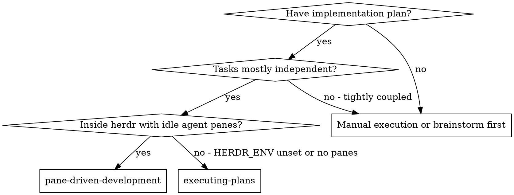
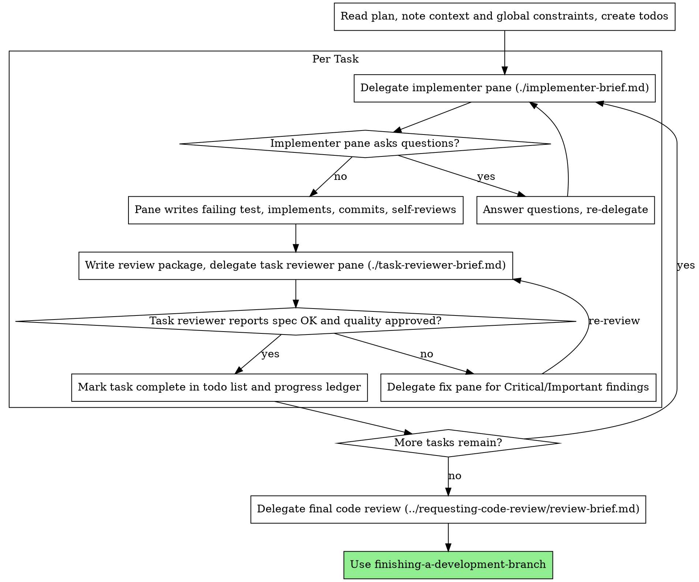

# Pane-Driven Development

**Placeholder resolution:** `<KEY>` placeholders in this file (such as `<BASE_BRANCH>` or `<REPORT_DIRECTORY>`) resolve from the `Herdrpowers Configuration` section of the repository's `CLAUDE.md` / `AGENTS.md`. If that section is missing, initialize it with the pack's init workflow (`/herdrpowers:init` on Claude Code plugin installs; `commands/init.md` otherwise).

## Delegation Model (READ FIRST)

Every task in this skill is delegated to a **herdr sibling agent pane**, never to an in-process subagent. The `orchestration` skill decides which role takes a task; `using-herdr-sibling-panes` is the transport that submits it and waits for the completion marker. Read both before delegating anything.

Two boundaries override anything below:

- **No in-process subagents.** Wherever this document says "dispatch," read "delegate to an idle sibling pane through `using-herdr-sibling-panes`." The Agent tool and named subagent types are not used by this pack.
- **The Coder pane that writes tests owns RED-GREEN-REFACTOR.** There is no separate test-writing agent. The implementing pane writes the failing test first per `test-driven-development` and reports RED/GREEN evidence. Review independence comes from the *fresh pane context* of the reviewing delegation, not from a different named role.

Execute the plan by delegating a fresh implementer pane per task, a task review (spec compliance + code quality) after each, and a broad whole-branch review at the end.

**Why panes:** a delegated pane starts from a reset session — it never inherits your context or history, so you construct exactly what it needs. That keeps it focused and preserves your own context for coordination work.

**Core principle:** Fresh pane per task + task review (spec + quality) + broad final review = high quality, fast iteration

**Narration:** between tool calls, narrate at most one short line — the ledger and the report files carry the record.

**Continuous execution:** Do not pause to check in with your human partner between tasks. Execute all tasks from the plan without stopping. The only reasons to stop are: BLOCKED status you cannot resolve, ambiguity that genuinely prevents progress, or all tasks complete.

## When to Use



**vs. Executing Plans (inline):**
- Fresh pane per task (no context pollution)
- Review after each task (spec compliance + code quality), broad review at the end
- Faster iteration (no human-in-loop between tasks)
- Requires `HERDR_ENV=1` and at least one idle sibling agent pane

## The Process



## Pre-Flight Plan Review

Before delegating Task 1, scan the plan once for conflicts:

- tasks that contradict each other or the plan's Global Constraints
- anything the plan explicitly mandates that the review rubric treats as a
  defect (meaningless test requirements, verbatim duplication of a logic block)

Present everything you find to your human partner as one batched question —
each finding beside the plan text that mandates it, asking which governs —
before execution begins, not one interrupt per discovery mid-plan. If the
scan is clean, proceed without comment. The review loop remains the net for
conflicts that only emerge from implementation.

## Role Selection

Routing is `orchestration`'s job, not this skill's. Resolve it from that skill's `roles.yaml` at the start of execution:

- **Implementation tasks, test authoring, code review** → Coder.
- **Chores discovered mid-plan** (lookups, file moves, log gathering, mechanical edits) → Generalist.
- **Plan revisions** stay with you, the orchestrator.

Panes are not reserved per role — pick any idle pane of the matching agent type at delegation time. When no pane of the right type is idle, wait; do not interrupt a working pane. When an agent type is exhausted (usage limit, or two markerless delegations on two panes of that type), take its substitute from `roles.yaml`'s `fallbacks:` map and name the fallback in your final report.

**Never delegate two implementation tasks into the same worktree at once.** One writer per working tree; that is the constraint parallelism has to respect, not the pane count.

## Handling Implementer Status

Implementer panes report one of four statuses. Handle each appropriately:

**DONE:** Generate the review package (`scripts/review-package BASE HEAD`, from this skill's directory — it prints the unique file path it wrote; BASE is the commit you recorded before delegating the task — never `HEAD~1`, which silently drops all but the last commit of a multi-commit task), then delegate the task review with the printed path.

**DONE_WITH_CONCERNS:** The pane completed the work but flagged doubts. Read the concerns before proceeding. If they are about correctness or scope, address them before review. If they are observations (e.g., "this file is getting large"), note them and proceed to review.

**NEEDS_CONTEXT:** The pane needs information that was not provided. Provide the missing context and re-delegate.

**BLOCKED:** The pane cannot complete the task. Assess the blocker:
1. If it is a context problem, provide more context and re-delegate
2. If the task needs more reasoning, re-delegate to a Coder pane (or its fallback) rather than a Generalist
3. If the task is too large, break it into smaller pieces
4. If the plan itself is wrong, escalate to the human

**No marker, no report:** that is not a status — it is a failed delegation. Diagnose it with `using-herdr-sibling-panes`' "Failure handling" table (crashed / blocked / interrupted / errored / exhausted) before re-delegating anything.

**Never** ignore an escalation or re-delegate the same task unchanged. If the pane said it is stuck, something needs to change.

## Handling Reviewer ⚠️ Items

The task reviewer may report "⚠️ Cannot verify from diff" items — requirements
that live in unchanged code or span tasks. These do not block the rest of the
review, but you must resolve each one yourself before marking the task
complete: you hold the plan and cross-task context the reviewer
lacks. If you confirm an item is a real gap, treat it as a failed spec
review — send it back and re-review.

## Constructing Reviewer Briefs

Per-task reviews are task-scoped gates. The broad review happens once, at the
final whole-branch review. When you fill a reviewer template:

- Send the review to a **fresh pane**, and prefer an idle pane of a different
  agent type than the one that implemented the change. Never send a change
  back for review to the pane that wrote it.
- Do not add open-ended directives like "check all uses" or "run race tests
  if useful" without a concrete, task-specific reason
- Do not ask a reviewer to re-run tests the implementer already ran on the
  same code — the implementer's report carries the test evidence
- Do not pre-judge findings for the reviewer — never instruct a reviewer to
  ignore or not flag a specific issue. If you believe a finding would be a
  false positive, let the reviewer raise it and adjudicate it in the review
  loop. If the brief you are writing contains "do not flag," "don't treat X
  as a defect," "at most Minor," or "the plan chose" — stop: you are
  pre-judging, usually to spare yourself a review loop.
- The global-constraints block you hand the reviewer is its attention
  lens. Copy the binding requirements verbatim from the plan's Global
  Constraints section or the spec: exact values, exact formats, and the
  stated relationships between components ("same layout as X", "matches
  Y"). The reviewer's template already carries the process rules (YAGNI,
  verification hygiene, review method) — the constraints block is for what THIS
  project's spec demands.
- Hand the reviewer its diff as a file: run this skill's
  `scripts/review-package BASE HEAD` and pass the reviewer the file path
  it prints (or, without bash: `git log --oneline`, `git diff --stat`,
  and `git diff -U10` for the range, redirected to one uniquely named
  file). The output never enters your own context, and the reviewer sees
  the commit list, stat summary, and full diff with context in one Read
  call. Use the BASE you recorded before delegating the task —
  never `HEAD~1`, which silently truncates multi-commit tasks.
- A brief describes one task, not the session's history. Do not
  paste accumulated prior-task summaries ("state after Tasks 1-3") into
  later delegations — a real session's dispatch hit 42k chars of which 99%
  was pasted history. A fresh pane needs its task, the interfaces it
  touches, and the global constraints. Nothing else.
- Delegate fixes for Critical and Important findings. Record Minor
  findings in the progress ledger as you go, and point the final
  whole-branch review at that list so it can triage which must be fixed
  before merge. A roll-up nobody reads is a silent discard.
- A finding labeled plan-mandated — or any finding that conflicts with
  what the plan's text requires — is the human's decision, like any plan
  contradiction: present the finding and the plan text, ask which governs.
  Do not dismiss the finding because the plan mandates it, and do not
  delegate a fix that contradicts the plan without asking.
- The final whole-branch review gets a package too: run
  `scripts/review-package MERGE_BASE HEAD` (MERGE_BASE = the commit the
  branch started from, e.g. `git merge-base <BASE_BRANCH> HEAD`) and include the
  printed path in the final review brief, so the final reviewer reads
  one file instead of re-deriving the branch diff with git commands.
- Every fix delegation carries the implementer contract: the fix pane
  re-runs the verification covering its change, writes new or changed tests
  itself under RED-GREEN-REFACTOR, and reports the results. Name the
  covering test files or commands in the brief — a one-line fix does not
  need the whole suite. Before re-delegating the review, confirm the fix
  report contains the covering commands and output.
- If the final whole-branch review returns findings, delegate ONE fix
  with the complete findings list — not one pane per finding.
  Per-finding fixers each rebuild context and re-run suites; a real
  session's final-review fix wave cost more than all its tasks combined.

## File Handoffs

A pane's terminal is lossy: an agent CLI on the alternate screen drops rows
that `pane read` can never recover, and everything you paste into a brief
stays resident in your own context for the rest of the session. Hand
artifacts over as files, in both directions:

- **Task brief:** before delegating an implementer, run this skill's
  `scripts/task-brief PLAN_FILE N` — it extracts the task's full text to a
  uniquely named file and prints the path. Compose the delegation so the
  brief stays the single source of requirements. Your instruction should
  contain: (1) the absolute worktree path, and the requirement to confirm
  the pane is in it before doing anything else; (2) one line on where this
  task fits in the project; (3) the brief path, introduced as "read this
  first — it is your requirements, with the exact values to use verbatim";
  (4) interfaces and decisions from earlier tasks that the brief cannot
  know; (5) your resolution of any ambiguity you noticed in the brief;
  (6) the report-file path and report contract; (7) the split completion
  marker; (8) the no-re-delegation clause.
- **Report file:** name the implementer's report file after the brief
  (brief `…/task-N-brief.md` → report `…/task-N-report.md`) and put it in
  the instruction. The pane writes the full report there and replies with
  only status, commits, a one-line test summary, concerns, and the marker.
- **Reviewer inputs:** the task reviewer gets three paths — the same brief
  file, the report file, and the review package — plus the global
  constraints that bind the task.
- Fix delegations append their fix report (with test results) to the same
  report file and reply with a short summary; re-reviews read the updated file.
- Keep the instruction itself on a single line: `composer-submit.sh`
  rejects embedded newlines. Detail belongs in the files it points at.

## Durable Progress

Conversation memory does not survive compaction. In real sessions,
orchestrators that lost their place have re-delegated entire completed task
sequences — the single most expensive failure observed. Track progress in
a ledger file, not only in todos.

- At skill start, check for a ledger:
  `cat "$(git rev-parse --show-toplevel)/.herdrpowers/pdd/progress.md"`. Tasks listed there
  as complete are DONE — do not re-delegate them; resume at the first task
  not marked complete.
- When a task's review comes back clean, append one line to the ledger in
  the same message as your other bookkeeping:
  `Task N: complete (commits <base7>..<head7>, review clean)`.
- The ledger is your recovery map: the commits it names exist in git even
  when your context no longer remembers creating them. After compaction,
  trust the ledger and `git log` over your own recollection.
- `git clean -fdx` will destroy the ledger (it's git-ignored scratch); if
  that happens, recover from `git log`.

## Brief Templates

- [implementer-brief.md](implementer-brief.md) - Implementer pane brief
- [task-reviewer-brief.md](task-reviewer-brief.md) - Task reviewer pane brief (spec compliance + code quality)
- Final whole-branch review: use requesting-code-review's [review-brief.md](../requesting-code-review/review-brief.md)

## Example Workflow

```
You: I'm using Pane-Driven Development to execute this plan.

[Read plan file once: docs/herdrpowers/plans/feature-plan.md]
[Read orchestration/roles.yaml; herdr pane list -> w2:p18 (codex, idle), w2:p19 (cursor, idle)]
[Create todos for all tasks]

Task 1: Hook installation script

[Run task-brief for Task 1]
[composer-submit.sh w2:p18 with worktree path + brief path + report path + marker]

Implementer pane: "Before I begin - should the hook be installed at user or system level?"

You: [re-delegate with the answer: user level]

[Later] Implementer pane (marker matched, report file read):
  - Wrote failing test first (RED), implemented install-hook (GREEN), 5/5 passing
  - Self-review: Found I missed --force flag, added it
  - Committed

[Run review-package; delegate the task review to w2:p19 - different agent type, fresh session]
Task reviewer: Spec OK - all requirements met, nothing extra.
  Strengths: Clear verification evidence, clean implementation. Issues: None. Task quality: Approved.

[Append to ledger; mark Task 1 complete]

Task 2: Recovery modes

[Run task-brief for Task 2; delegate to an idle Coder pane]

Implementer pane:
  - Added verify/repair modes, 8/8 tests passing, RED/GREEN evidence in report
  - Committed

[Run review-package; delegate the task review to a fresh pane]
Task reviewer: Spec FAILED:
  - Missing: Progress reporting (spec says "report every 100 items")
  - Extra: Added --json flag (not requested)
  Issues (Important): Magic number (100)

[Delegate ONE fix with all findings]
Fix pane: Removed --json flag, added progress reporting, extracted PROGRESS_INTERVAL constant

[Re-review]
Task reviewer: Spec OK. Task quality: Approved.

[Append to ledger; mark Task 2 complete]

...

[After all tasks: final whole-branch review package -> fresh pane]
Final reviewer: All requirements met, ready to merge

Done!
```

## Advantages

**vs. Manual execution:**
- Panes follow TDD naturally
- Fresh context per task (no confusion)
- A pane can ask questions (before AND during work)
- The orchestrator's context stays free for coordination

**vs. Executing Plans:**
- Continuous progress (no human-in-loop between tasks)
- Review checkpoints automatic
- Independent panes can carry independent tracks concurrently

**Efficiency gains:**
- Orchestrator curates exactly what context is needed; bulk artifacts move
  as files, not pasted text
- Pane gets complete information upfront
- Questions surfaced before work begins (not after)

**Quality gates:**
- Self-review catches issues before handoff
- Task review carries two verdicts: spec compliance and code quality
- Review loops ensure fixes actually work
- Spec compliance prevents over/under-building

**Cost:**
- More delegations (implementer + reviewer per task)
- Orchestrator does more prep work (extracting all tasks upfront)
- Review loops add iterations
- But catches issues early (cheaper than debugging later)

## Red Flags

**Never:**
- Start implementation on the base branch without explicit user consent
- Use `pane run` to submit work to an agent pane — use `composer-submit.sh`
- Send a delegation without a completion marker, a report-file path, and the absolute worktree path
- Let a delegated pane re-delegate: every brief carries the no-re-delegation clause
- Skip task review, or accept a report missing either verdict (spec compliance AND task quality are both required)
- Proceed with unfixed issues
- Run two implementation panes against the same worktree
- Make a pane read the whole plan file (hand it its task brief —
  `scripts/task-brief` — instead)
- Skip scene-setting context (the pane needs to understand where the task fits)
- Ignore a pane's questions (answer before letting it proceed)
- Accept "close enough" on spec compliance (reviewer found spec issues = not done)
- Skip review loops (reviewer found issues = fix = review again)
- Let a pane's self-review replace actual review (both are needed)
- Tell a reviewer what not to flag, or pre-rate a finding's severity in the
  brief ("treat it as Minor at most") — the plan's example code is
  a starting point, not evidence that its weaknesses were chosen
- Delegate a task review without a diff file — generate it first
  (`scripts/review-package BASE HEAD`) and name the printed path in the
  brief
- Trust "tests pass" without reading the quoted output in the report file
- Move to the next task while the review has open Critical/Important issues
- Re-delegate a task the progress ledger already marks complete — check
  the ledger (and `git log`) after any compaction or resume

**If a pane asks questions:**
- Answer clearly and completely
- Provide additional context if needed
- Don't rush it into implementation

**If the reviewer finds issues:**
- Delegate the fix (to the implementing pane if it is still idle and holds the context, otherwise to a fresh one)
- Review again
- Repeat until approved
- Don't skip the re-review

**If a pane fails the task:**
- Diagnose with `using-herdr-sibling-panes`' failure table first
- Then re-delegate with what changed — don't fix it yourself (context pollution)

## Integration

**Required workflow skills:**
- **orchestration** - Decides which role takes each delegation and how fallbacks resolve
- **using-herdr-sibling-panes** - The delegation transport: composer-safe submission, markers, failure handling
- **using-git-worktrees** - Ensures isolated workspace (creates one or verifies existing)
- **writing-plans** - Creates the plan this skill executes
- **requesting-code-review** - Review brief for the final whole-branch review
- **finishing-a-development-branch** - Complete development after all tasks

**Delegated panes should use:**
- **test-driven-development** - The implementing pane owns RED-GREEN-REFACTOR for its task
- **systematic-debugging** - Root cause before fix, in the pane and in the orchestrator

**Alternative workflow:**
- **executing-plans** - Use when herdr panes are unavailable (`HERDR_ENV` unset, or no idle agent panes)
