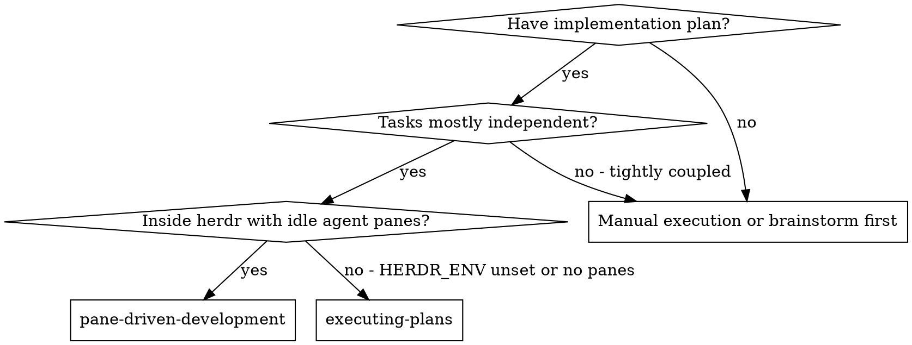
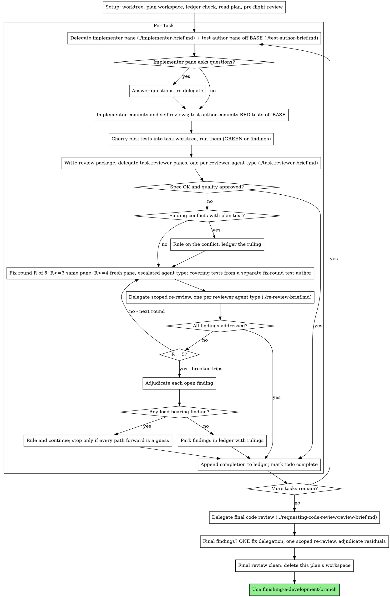

# Pane-Driven Development

**Placeholder resolution:** `<KEY>` placeholders in this file (such as `<BASE_BRANCH>` or `<REPORT_DIRECTORY>`) resolve from the `Herdrpowers Configuration` section of the repository's `CLAUDE.md` / `AGENTS.md`. If that section is missing, initialize it with the pack's init workflow (`/herdrpowers:init` on Claude Code plugin installs; `commands/init.md` otherwise).

## Delegation Model (READ FIRST)

Every task in this skill is delegated to a **herdr sibling agent pane**, never to an in-process subagent. The `orchestration` skill decides which role takes a task; `using-herdr-sibling-panes` is the transport that submits it and waits for the completion marker. Read both before delegating anything.

Two boundaries override anything below:

- **No in-process subagents.** Wherever this document says "dispatch," read "delegate to an idle sibling pane through `using-herdr-sibling-panes`." The Agent tool and named subagent types are not used by this pack.
- **The pane that writes tests owns RED-GREEN-REFACTOR**, and the resolved `test-authoring` / `fix-round-test-authoring` assignments say which pane that is. With `mode: delegate` a separate pane writes them from the task brief alone (see "Parallel test authoring" below); with `mode: implementer` the implementing or fixing pane writes its own per `test-driven-development`. Either way the pane that writes a test produces its RED evidence, and your report names which pane wrote the tests. Review independence itself comes from the *reset session* of each reviewing delegation, not from a named role or a different pane ID, and is never configurable.

Execute the plan by delegating a fresh implementer pane per task, the task's tests per `test-authoring`, a task review (spec compliance + code quality) after each, and a broad whole-branch review at the end.

**Why panes:** a delegated pane starts from a reset session — it never inherits your context or history, so you construct exactly what it needs. That keeps it focused and preserves your own context for coordination work.

**Core principle:** Fresh pane per task + task review (spec + quality) + broad final review = high quality, fast iteration

**Narration:** between tool calls, narrate at most one short line — the ledger and the report files carry the record.

**Continuous execution:** Do not pause to check in with your human partner between tasks. Execute all tasks from the plan without stopping. The only reasons to stop are the four named below, or all tasks complete.

**Rulings, not stalls.** A running plan does not wait on a human. Conflicts,
ambiguities, plan defects, a fix round that ended at the cap — decide them. The
spec is the binding authority, the plan is its argument, and your judgment
settles what neither answers. Record every decision in the ledger as
`Ruling: <what you decided> — <why> — <what it costs if wrong>`, and keep
going. A wrong ruling costs rework your human partner can see and undo; a
session parked on a question costs their whole day and buys nothing.

Four things stop you, and only these: an irreversible or destructive
operation; a security-sensitive action; a side effect outside this worktree
that norms say you ask about first (a merge, a push to a shared branch, a
publish); and a plan so broken that every path forward is a guess. For those,
stop and ask.

**A ruling never rewrites the run's terms.** It resolves what the spec and the
plan left open — it does not raise the five-round cap, re-enable a gate the
repository disabled, disable one it enabled, widen `delegation.pane_scope`, or
touch `.herdrpowers/config.yaml`. Those are the user's declaration, resolved
once at start; a "ruling" that changes one is falsifying the run's terms, not
deciding under them.

## When to Use



**vs. Executing Plans (inline):**
- Fresh pane per task (no context pollution)
- Review after each task (spec compliance + code quality), broad review at the end
- Faster iteration (no human-in-loop between tasks)
- Requires `HERDR_ENV=1` and at least one idle sibling agent pane inside `delegation.pane_scope` (default: the orchestrator's own tab)

## The Process



## Setup

Ensure the work happens in an isolated workspace: use `using-git-worktrees` to
create one or verify the existing one. Never start implementation on
`<BASE_BRANCH>` (or main/master) without your human partner's explicit consent.

Conversation memory does not survive compaction. In real sessions,
orchestrators that lost their place have re-delegated entire completed task
sequences — the single most expensive failure observed. Track progress in
a ledger file, not only in todos.

- Each plan owns a workspace: at skill start, run this skill's
  `scripts/pdd-workspace PLAN_FILE` — it prints the plan's git-ignored
  directory (`<repo-root>/.herdrpowers/pdd/<plan-basename>/`), home to
  every artifact for THIS plan: ledger, briefs, reports, review packages.
  Another plan's directory is never yours to read or write.
- Check for this plan's ledger at `<workspace>/progress.md`. If its first
  line names your plan file, tasks with a `Task <N>: complete` line are DONE
  — do not re-delegate them; resume at the first task without one. A task
  whose last line is a fix round is mid-loop: resume the loop at the next
  round. A ledger whose first line names a different plan file — or a stray
  ledger at the old flat path `.herdrpowers/pdd/progress.md` — is another
  plan's progress: leave it in place and start your own, fresh.
- Create the ledger with its identity as the first line:
  `# PDD ledger — plan: <plan file path>`.
- The ledger is your recovery map: the commits it names exist in git even
  when your context no longer remembers creating them. After compaction,
  trust the ledger and `git log` over your own recollection.
- `git clean -fdx` will destroy the workspace (it's git-ignored scratch); if
  that happens, recover from `git log`.

Read the plan once, note its context and Global Constraints, and create a
todo per task. If the plan names a Spec, read that too: the spec is the
authority the plan argues from, and conflicts inside the plan resolve
against it. A plan with no reachable spec gets a ledger note saying so —
rulings made without one are provisional.

Before delegating Task 1, scan the plan once for conflicts, writing down what
you checked as you check it:

- tasks that contradict each other or the plan's Global Constraints
- anything the plan explicitly mandates that the review rubric treats as a
  defect (a test that asserts nothing, verbatim duplication of a logic block)

The scan's output is a table, not a verdict. One row for every pair of tasks
that share a file or an interface: the two tasks, what one produces against
what the other consumes, and what you found. One row for every task: whether
its own text agrees with itself — the tests it specifies against the code it
specifies, the files it creates against the files it later touches. "The scan
is clean" without those rows is not a scan you ran.

Write the table to the ledger. Rule on each conflict it surfaces before
execution begins — the spec is the binding authority, the plan is its argument
— record the ruling beside its row, and delegate Task 1. If the scan is clean,
proceed without comment. The review loop remains the net for conflicts that
only emerge from implementation.

## Delegation Assignments

Routing is `orchestration`'s job, not this skill's. Resolve the whole
`assignments:` table at the start of execution from the merged configuration it
describes — `<repo-root>/.herdrpowers/config.yaml` first, then the pack's
`orchestration/roles.yaml` for anything the repo file omits. Resolve once, up
front; do not re-read per task.

Seven tasks in that table drive this loop. Read each one's `role` and `mode`
from the resolved configuration — this table only says where each lands:

| Task | Where it lands in this skill |
|---|---|
| `complex-coding` / `simple-coding` | §1, the implementer delegation |
| `test-authoring` | §1, the test-author delegation |
| `task-review` | §3 |
| `review-fixes` | §4's fix delegation |
| `fix-round-test-authoring` | §4's covering tests for the round |
| `fix-round-re-review` | §4's scoped re-review |
| `chores` | Lookups, file moves, log gathering, mechanical edits found mid-plan |

Plan revisions stay with you, the orchestrator (`plan-and-design`).

Four resolved values change the loop's shape:

- **`task-review` disabled** — skip §3 entirely. A task then completes on
  the implementing pane's own report: read it, resolve any concerns, and record
  the completion line. There is no fix loop to enter, because nothing produced
  findings. Name the disabled gate in your final report.
- **`fix-round-re-review` disabled** — a fix round ends when the fix
  report shows the covering tests, the command, and the output. The round still
  counts against the five-round cap, and the breaker still trips at five with
  whatever findings the fixing pane did not claim as fixed. Name the disabled
  gate in your final report.
- **`test-authoring: {mode: implementer}`** — no test-author delegation in §1.
  The implementer's brief carries RED-GREEN-REFACTOR ownership instead, and the
  reviewers become the only independent check on test code its author also
  implemented.
- **`fix-round-test-authoring: {mode: implementer}`** — the fixing pane writes
  or amends the round's covering tests itself, instead of a separate pane
  doing it in §4.

**A review task assigned to a role that binds to a list of agent types runs
once per entry** — see "Roles that bind to a list" in `orchestration`. With the
shipped `reviewer` role, §3 and §4's re-review are each two independent reviews
in separate panes: wait for all of them, merge their findings into one open
list (a finding raised by either counts), and deduplicate before delegating the
fix. Degrade per that section when a listed agent type has no pane, and name
the degradation in your report.

The `final-branch-review` gate belongs to the calling workflow, not to this
skill: when it is disabled, skip the Final Review section below.

**Independence is not configurable.** With `task-review` on, the review is always
a reset-backed delegation to the resolved role's agent type(s) — same physical
pane is fine after a reset; do not review inside an unreset implementing
session. And `review-fixes` escalates at rounds 4-5 to a fresh pane regardless
of its mode.

Panes are not reserved per role — pick any idle pane of the matching agent type **within `delegation.pane_scope`** (default `tab`: the orchestrator's own tab only) at delegation time. When no in-scope pane of the right type is idle, wait; do not interrupt a working pane, and do not reach into another tab. When an agent type is exhausted (usage limit, or two markerless delegations on two panes of that type), take its substitute from the resolved `fallbacks:` map and name the fallback in your final report.

**Escalation is a type swap.** Panes have no model dial you control, so "try something stronger" means a different agent type: a fresh pane of another Coder-eligible type, or the substitute in `fallbacks:`. Use it when a pane reports BLOCKED for lack of reasoning, and at fix-loop rounds 4-5. Name the swap in the ledger line.

**Never delegate two implementation tasks into the same worktree at once.** One writer per working tree; that is the constraint parallelism has to respect, not the pane count.

## The Task Loop

**Batch small same-shape work.** When the plan lists several tasks that are
each a small, independent edit of the same kind — the same one-line fix,
constant change, or field addition repeated across files — do not delegate one
pane per task. Compose ONE brief listing every file and its change, delegate
the whole batch to a single pane, and treat it as one unit the rest of the way:
one review package, one review, one ledger completion line naming every task in
the batch. When a separate pane writes the tests, it works from that same
batched brief. Reserve one-delegation-per-task for work that needs its own
judgment, its own tests, or its own review surface.

Everything you paste into a delegation — and everything a pane prints back —
stays resident in your context for the rest of the session and is re-read on
every later turn. Hand artifacts over as files (see File Handoffs).

**While panes work, you work.** Waiting is not a phase — ledger updates,
packaging the next review, and reading reports all happen while children run.
When you are genuinely idle, wait in bounded stretches and reconcile between
them rather than sitting in one open-ended wait; `using-herdr-sibling-panes`
holds the mechanics.

### 1. Delegate the implementer and the test author

Record BASE (`git rev-parse HEAD`) before delegating — the review package,
the test author's worktree, and fix-round diffs all need it.

Run `scripts/task-brief PLAN_FILE N` to extract the task's full text into the
plan workspace. Never make a pane read the whole plan file. Exact values
(numbers, magic strings, signatures, test cases) appear only in the brief.

**The requirements file stays requirements — never append a role contract to
it.** Two panes may read it for the same task, and a file carrying both
"implement this" and "write tests only, never production code" hands each of
them the other's instructions. Each contract goes in its own file beside it,
pointing back at the requirements:

| File | Content | Template |
|---|---|---|
| `task-N-brief.md` | The task's requirements. Written once, read by every pane, appended to by none. | `scripts/task-brief` |
| `task-N-implementer.md` | The implementer contract, pointing at the requirements file. | [implementer-brief.md](implementer-brief.md) |
| `task-N-tests.md` | The test author contract, same pointer. Only when `test-authoring` is delegated. | [test-author-brief.md](test-author-brief.md) |

- If an earlier task parked a finding in the area this task touches, carry
  a pointer to that ledger entry in the delegation.
- Record the pane ID you delegated to — fix rounds 1-3 go back to that pane.

#### Parallel test authoring

When `test-authoring` resolves to `mode: delegate`, the task's tests come from
a pane that never sees the implementation. Delegate it per
`task-N-tests.md`, from the same requirements file, at the same time as the
implementer.

- **Its own worktree, detached at BASE.** One writer per working tree still
  binds, so the test author does not share the task worktree:
  `git worktree add --detach <plan-workspace>/tests-task-N BASE`. Detached, not
  `-b`: a named branch outlives `git worktree remove`, and a fixed name would
  then collide with the next fix round, a parallel track at the same task
  number, and the next plan. Starting at BASE is also where its RED comes
  from — the implementation does not exist there, so the new tests fail for
  the stated reason with no stashing or checkout games.
- **Its scope is `<TEST_FILE_LOCATIONS>` only.** It writes tests, runs
  `<TARGETED_TEST_COMMAND>`, quotes the failing output as RED evidence, and
  commits in its own worktree. It never writes production code, and it is
  never shown the implementation. Its report goes to
  `task-N-tests-report.md` — a separate file from the implementer's, because
  the two panes write concurrently.
- **The brief must pin the interface.** Both panes work from the same text, so
  exact names, signatures, and values have to be in it; if they are not, the
  tests fail on cosmetics rather than behavior. Pin them before delegating —
  and if the task genuinely cannot pin its interface up front, delegate the
  test author *after* the implementer reports, handing it the resulting
  interface, never the diff. Same requirements, same detached worktree at
  BASE, same RED; only the timing changes.
- **Merge, then run — this step produces the task's GREEN evidence.** When both
  panes report DONE, cherry-pick the test commit (the SHA the test author
  reported) into the task worktree and run `<TARGETED_TEST_COMMAND>` yourself.
  Append the result to the implementer's report file under a `Merged test run`
  heading — the command, its output, and the test author's pane and commit —
  so the report the reviewers read carries RED (from the test author) and GREEN
  (from this run) even though no single pane produced both. A task whose merged
  run fails has findings, not GREEN: they enter §4's fix loop like any other.
  Remove the test worktree once the commit is in
  (`git worktree remove <path>`).
- A cherry-pick conflict means both panes edited the same test file. Resolve it
  in favor of the test author's assertions, or re-delegate serialized as above.

When `test-authoring` resolves to `mode: implementer`, skip all of this: the
implementer's contract carries RED-GREEN-REFACTOR and its report carries both
RED and GREEN. Either way, your final report names which pane wrote the tests.

### 2. Handle the report

Implementer panes report one of four statuses. Handle each appropriately:

**DONE:** Generate the review package (`scripts/review-package PLAN_FILE BASE HEAD`, from this skill's directory — it prints the unique file path it wrote; BASE is the commit you recorded before delegating the task — never `HEAD~1`, which silently drops all but the last commit of a multi-commit task), then delegate the task review with the printed path.

**DONE_WITH_CONCERNS:** The pane completed the work but flagged doubts. Read the concerns before proceeding. If they are about correctness or scope, address them before review. If they are observations (e.g., "this file is getting large"), note them and proceed to review.

**NEEDS_CONTEXT:** The pane needs information that was not provided. Provide the missing context and re-delegate.

**BLOCKED:** The pane cannot complete the task. Assess the blocker with
`systematic-debugging` — root cause before fix, in the pane and in the
orchestrator:
1. If it is a context problem, provide more context and re-delegate to the same pane
2. If the task needs more reasoning, escalate the agent type (see Delegation Assignments)
3. If the task is too large, break it into smaller pieces
4. If the plan itself is wrong, rule on the correction, ledger it, and re-delegate with the ruling carried in the brief

**No marker, no report:** that is not a status — it is a failed delegation. Diagnose it with `using-herdr-sibling-panes`' "Failure handling" table (crashed / blocked / interrupted / errored / exhausted) before re-delegating anything.

**A delegated test author reports the same four statuses, and they resolve
before the merge step, not after it.** Both panes' statuses gate the task:

- **DONE / DONE_WITH_CONCERNS from both** — proceed to the merge-then-run step
  in §1.
- **NEEDS_CONTEXT from the test author** — it could not pin an assertion from
  the requirements. That is the brief's gap, and it is usually the
  implementer's gap too: answer it, amend `task-N-brief.md`, and re-delegate
  the test author; if the answer changes an interface the implementer is
  already building to, send it the correction as well.
- **BLOCKED from the test author** — the requirement cannot be observed, or the
  repo lacks the harness to observe it. Resolve it the way §5 resolves a
  "⚠️ Cannot verify" item: decide yourself whether the requirement is testable
  as written, and either amend the brief or record in the ledger that this
  requirement carries no test and why. Never let a task proceed with the gap
  unrecorded.
- **A test author that reports its tests passing at BASE** — that is the defect
  its contract tells it to report, not a shortcut past RED. Treat it as a
  finding against the test, not against the implementation.

While the test author is still working, do not delegate the review: the review
package must contain the merged tests.

**Never** ignore an escalation or re-delegate the same task unchanged. If the pane said it is stuck, something needs to change.

If the pane asks questions — before starting or mid-task — answer clearly and
completely, provide additional context if needed, and don't rush it into
implementation.

### 3. Review the task

Skip this step when `assignments.task-review` is disabled (see Delegation
Assignments) — go straight to §5 with the pane's own report.

Per-task reviews are task-scoped gates. The broad review happens once, at the
final whole-branch review. Never skip the task review, and never accept a
report missing either verdict — spec compliance AND task quality are both
required. A pane's self-review never replaces the task review; both are needed.

- Send the review to a **reset-backed pane** — one per agent type in the resolved
  role, in separate panes when the list has multiple entries, all from the same
  review package. Any idle pane of those types is fine, including the pane that
  implemented; do not apply a prefer-different-type heuristic. Wait for every
  review to return before acting on any of them; merge the findings into one
  open list and deduplicate. Reviews that disagree are yours to adjudicate,
  not to average.
- Hand the reviewer its diff as a file: run this skill's
  `scripts/review-package PLAN_FILE BASE HEAD` and pass the reviewer the file
  path it prints (or, without bash: `git log --oneline`, `git diff --stat`,
  and `git diff -U10` for the range, redirected to one uniquely named
  file). The output never enters your own context, and the reviewer sees
  the commit list, stat summary, and full diff with context in one Read
  call. Use the BASE you recorded before delegating the task —
  never `HEAD~1`, which silently truncates multi-commit tasks. Never
  delegate a task review without a diff file.
- **Reviewer inputs:** the task reviewer gets three paths — the requirements
  file `task-N-brief.md`, the implementer's report file, and the review
  package — plus the global constraints that bind the task. When a separate
  pane wrote the tests, add its report file as a fourth path and say so: the
  RED evidence lives there, the GREEN evidence lives in the merged-test-run
  section of the implementer's report, and a reviewer told to expect both in
  one report will otherwise raise missing RED/GREEN as a finding on a
  perfectly healthy task.
- The global-constraints block you hand the reviewer is its attention
  lens. Copy the binding requirements verbatim from the plan's Global
  Constraints section or the spec: exact values, exact formats, and the
  stated relationships between components ("same layout as X", "matches
  Y"). The reviewer's template already carries the process rules (YAGNI,
  verification hygiene, review method) — the constraints block is for what THIS
  project's spec demands.
- A brief describes one task, not the session's history. Do not
  paste accumulated prior-task summaries ("state after Tasks 1-3") into
  later delegations — a real session's dispatch hit 42k chars of which 99%
  was pasted history. A fresh pane needs its task, the interfaces it
  touches, and the global constraints. Nothing else.
- Do not add open-ended directives like "check all uses" or "run race tests
  if useful" without a concrete, task-specific reason
- Do not ask a reviewer to re-run tests the implementer already ran on the
  same code — the implementer's report carries the test evidence
- Do not pre-judge findings for the reviewer — never instruct a reviewer to
  ignore or not flag a specific issue. If you believe a finding would be a
  false positive, let the reviewer raise it and adjudicate it in the review
  loop. If the brief you are writing contains "do not flag," "don't treat X
  as a defect," "at most Minor," or "the plan chose" — stop: you are
  pre-judging, usually to spare yourself a review loop.

The task reviewer may report "⚠️ Cannot verify from diff" items — requirements
that live in unchanged code or span tasks. These do not block the rest of the
review, but you must resolve each one yourself before marking the task
complete: you hold the plan and cross-task context the reviewer
lacks. If you confirm an item is a real gap, treat it as a failed spec
review — it enters the fix loop with the other findings.

Template: [task-reviewer-brief.md](task-reviewer-brief.md)

### 4. The fix loop

The loop triggers when the review reports spec ❌, any Critical or Important
finding, or a ⚠️ item you confirmed as a real gap.

Before the loop starts, two routes leave it immediately:

- Record Minor findings in the progress ledger as you go
  (`Task <N>: minor (deferred): <one-liner>`), and point the final
  whole-branch review at that list so it can triage which must be fixed
  before merge. A roll-up nobody reads is a silent discard. Minor findings
  never enter the loop.
- A finding labeled plan-mandated — or any finding that conflicts with
  what the plan's text requires — is yours to rule on: weigh the finding
  against the plan text, decide with the spec as the binding authority, and
  ledger the ruling before you act on it. Do not dismiss the finding because
  the plan mandates it, and do not delegate a fix that contradicts the plan
  without a recorded ruling.

Everything else enters the loop. A fix round is one fix delegation plus one
scoped re-review. Five rounds maximum per task:

**Rounds 1-3 — go back to the same implementing pane.** Send it the open
findings verbatim through `composer-submit.sh`, with a fresh completion
marker. Its session is intact: it knows the task, the code, and its own
choices. If that pane has been reset, crashed, or is no longer idle,
delegate to a fresh pane of the same agent type carrying the brief path, the
report-file path, and the findings — the report file is the persistent memory
either way.

**Rounds 4-5 — delegate to a fresh pane of an escalated agent type** (see
Delegation Assignments), with the brief path, the report-file path, the open findings,
and this framing: "A prior pane attempted this task [N] times; you own it now.
Read the report file for what was tried." A loop that survives three rounds in
one session usually means that pane cannot see its own problem — fresh eyes and
a capability swap in one move.

**Every round, either way:** the fixing pane fixes, re-runs the verification
covering the amended code, appends its fix report to the same report file, and
replies with the short contract. Name the covering test files in the fix
message — a one-line fix does not need the whole suite.

**The round's covering tests come from `fix-round-test-authoring`.** When it
resolves to `mode: implementer`, the fixing pane writes or amends them itself
under RED-GREEN-REFACTOR and its fix report carries RED and GREEN, exactly as
before. When it resolves to `mode: delegate`, the round runs in four ordered
steps and **the evidence is assembled by you, not by any one pane** — no pane
sees both halves:

1. **Delegate both, from the findings.** The fixing pane changes source only.
   The test author is a pane that is neither the fixing pane nor the
   implementation round's test author — a fix's tests written by whoever just
   changed the behavior prove only that the behavior changed. Write its
   contract to `task-N-fix-R-tests.md` per
   [test-author-brief.md](test-author-brief.md), using that template's fix-round
   variant, and give it the open findings — not the fix diff.
2. **Its worktree is detached at FIX_BASE**, the head the previous review saw:
   `git worktree add --detach <plan-workspace>/tests-task-N-fix-R FIX_BASE`.
   The buggy implementation *is* present there — that is the point. Its RED is
   the finding reproducing: a new test must fail because the finding is still
   unfixed, and a test that passes at FIX_BASE does not cover the finding.
3. **Cherry-pick, then run.** Once both report, cherry-pick the test commit onto
   the fix head and run the covering tests yourself. That run is the round's
   GREEN.
4. **Consolidate before the re-review.** Append to the fix report: the covering
   tests, the command, its output, and which pane wrote them. Only then
   delegate the re-review. A re-reviewer handed a fix report with no test
   evidence returns NOT ADDRESSED on a fix that is fine, and burns a round of
   the five-round cap doing it.

Either mode: confirm the fix report contains the covering tests, the command
run, and the output before delegating the re-review. Remove the round's test
worktree once its commit is in.

**The re-review is scoped.** Skipped when `assignments.fix-round-re-review` is
disabled — the round then closes on the fix report's covering tests, command,
and output, and the cap still counts it. Otherwise: run
`scripts/review-package PLAN_FILE FIX_BASE HEAD`
where FIX_BASE is the head the previous review saw, and delegate
[re-review-brief.md](re-review-brief.md) to a fresh pane — one per agent type
in the resolved role — with the findings list, the brief, the report file, and
the printed diff path. Each re-reviewer verdicts each finding ADDRESSED or NOT
ADDRESSED and flags new breakage in the fix diff only; a finding is closed only
when every re-reviewer that ran calls it ADDRESSED. New Critical/Important
breakage in the fix diff joins the open findings list. Out-of-scope
observations go to the ledger as deferred minors — they never extend the loop.

**After each round,** append to the ledger:
`Task <N>: fix round <R>/5 (<X> addressed, <Y> open — <finding one-liners>; commits <a7>..<b7>)`

Never fix findings yourself in the orchestrator pane — your context stays
clean for coordination, and orchestrator fixes skip review.

**The breaker.** When round 5's re-review still leaves findings open, stop
delegating. Adjudicate each open finding yourself — you hold the plan and
the cross-task context the reviewer lacks:

- **The reviewer is wrong, or the point is contestable:** park it —
  `Task <N>: parked — <finding> — Ruling: <why the code stands>`. The final
  review sees both sides.
- **Real, but nothing downstream builds on it:** park it the same way, with
  a ruling that says it's real and deferred.
- **Real and load-bearing** — a later task builds on it, or it reveals a
  plan defect: rule on the smallest change that unblocks the dependent work,
  ledger it as `Task <N>: Ruling: <finding> — <what you decided and why>`,
  and carry it into the next task's brief. Parking a structural failure
  silently lets every dependent task build on it and hands the final review a
  problem it cannot fix either. Stop only when the defect leaves every path
  forward a guess.

Adjudicate only at the cap. Adjudicating earlier to end a loop is
pre-judging with a different name. Every adjudication is a ledger entry —
a silent discard is forbidden.

### 5. Complete the task

When the review comes back clean — or every open finding is parked with a
ruling at the cap — append the completion line to the ledger in the same
message as your other bookkeeping:

- `Task <N>: complete (commits <base7>..<head7>, review clean)`
- `Task <N>: complete (commits <base7>..<head7>, <K> parked)` after a
  tripped breaker

Then mark the todo complete and move on. Never move to the next task while
the review has open Critical/Important issues that are neither fixed nor
parked-with-ruling at the cap.

## Final Review

Skipped when the calling workflow's `assignments.final-branch-review` gate is
disabled; go straight to Finish and say the branch is unreviewed.

The final whole-branch review gets a package too: run
`scripts/review-package PLAN_FILE MERGE_BASE HEAD` (MERGE_BASE = the commit the
branch started from, e.g. `git merge-base <BASE_BRANCH> HEAD`) and include the
printed path in the final review brief, so the final reviewer reads
one file instead of re-deriving the branch diff with git commands. Delegate it
to any idle pane of the resolved role's agent type(s) via a reset-backed submit —
using `requesting-code-review`'s
[review-brief.md](../requesting-code-review/review-brief.md). Point it at
the ledger's deferred-minor and parked lines so it can triage which must be
fixed before merge.

If the final whole-branch review returns findings, delegate ONE fix pane
with the complete findings list — not one pane per finding.
Per-finding fixers each rebuild context and re-run suites; a real
session's final-review fix wave cost more than all its tasks combined.
Then run exactly one scoped re-review of the fix wave
(`scripts/review-package PLAN_FILE FIX_BASE HEAD`,
[re-review-brief.md](re-review-brief.md)).
Adjudicate any residual findings as in the task loop's breaker: park with
rulings, or rule on the load-bearing ones and ledger what you decided. Only
the four stop-classes named at the top of this skill stop you here. There is
no second fix wave — residual load-bearing findings surface to your human
partner when finishing-a-development-branch presents the options.

## Finish

Before you delete anything, collect every ledger line containing `Ruling:` —
preflight rulings, parked findings, breaker adjudications, all of them — into
your final report under "Rulings I made", in the order you made them, each
with what it costs if wrong. The list is exhaustive: if the ledger holds a
ruling, the list holds it. That list is the only place the decisions you took
on your human partner's behalf reach them — they read it and rework whatever
you got wrong. A ruling that dies with the workspace was a decision made in
secret. It goes in the same report that names every assignment the repository
changed and every disabled gate.

When the final whole-branch review is clean and its fixes are merged,
delete this plan's workspace (`rm -rf <workspace>`) — the git history is
the record now. Sibling directories belong to other plans; leave them
alone.

Use `finishing-a-development-branch`.

## File Handoffs

A pane's terminal is lossy: an agent CLI on the alternate screen drops rows
that `pane read` can never recover, and everything you paste into a brief
stays resident in your own context for the rest of the session. Hand
artifacts over as files, in both directions:

- **Requirements file:** `scripts/task-brief PLAN_FILE N` writes the task's
  full text into the plan workspace and prints the path. It stays the single
  source of requirements, read by every pane on the task and edited by none —
  role contracts go in their own files beside it (`task-N-implementer.md`,
  `task-N-tests.md`, `task-N-fix-R-tests.md`), each naming this one. Your
  instruction should contain: (1) the absolute worktree path, and the
  requirement to confirm the pane is in it before doing anything else; (2) one
  line on where this task fits in the project; (3) the contract path,
  introduced as "read this first — it is your contract, and it names your
  requirements file"; (4) interfaces and decisions from earlier tasks that the
  requirements cannot know; (5) your resolution of any ambiguity you noticed in
  them; (6) the report-file path and report contract; (7) the split completion
  marker; (8) the no-re-delegation clause.
- **Report files, one per pane:** name each after the requirements file
  (`…/task-N-brief.md` → `…/task-N-report.md` for the implementer,
  `…/task-N-tests-report.md` for a delegated test author). Never share one
  report file between concurrent panes. Each pane writes its full report there
  and replies with only status, commits, a one-line test summary, concerns, and
  the marker.
- **Reviewer inputs:** the task reviewer gets three paths — the requirements
  file, the implementer's report file, and the review package — plus the global
  constraints that bind the task, plus the test author's report file when a
  separate pane wrote the tests.
- Fix rounds append their fix report (with test results) to the implementer's
  report file and reply with a short summary; re-reviews read the updated file.
  A delegated fix-round test author writes its own report, and you fold its
  evidence into the fix report before the re-review.
- Keep the instruction itself on a single line: `composer-submit.sh`
  rejects embedded newlines. Detail belongs in the files it points at.

## Brief Templates

- [implementer-brief.md](implementer-brief.md) - Implementer pane brief
- [test-author-brief.md](test-author-brief.md) - Test author pane brief, for `test-authoring` / `fix-round-test-authoring` in `mode: delegate`
- [task-reviewer-brief.md](task-reviewer-brief.md) - Task reviewer pane brief (spec compliance + code quality), one per reviewer agent type
- [re-review-brief.md](re-review-brief.md) - Scoped re-review pane brief, one per reviewer agent type per fix round
- Final whole-branch review: use requesting-code-review's [review-brief.md](../requesting-code-review/review-brief.md)

## Common Rationalizations

| Excuse | Reality |
|--------|---------|
| "Close enough on spec compliance" | Reviewer found spec gaps = not done. Fix or hit the cap and adjudicate — those are the only exits. |
| "I'll fix it myself, delegating is overhead" | Orchestrator fixes pollute your context and skip review. Send the findings back to the implementing pane. |
| "One more round will converge" | Past the cap, rounds don't converge — the failure is structural. Adjudicate and route. |
| "The reviewer will just find something new anyway" | Scoped re-reviews verify fixes; they cannot wander. New findings on untouched code go to the ledger, not the loop. |
| "This finding is obviously wrong, I'll drop it" | You adjudicate only at the cap, and every ruling is a ledger entry. Silent discards are forbidden. |
| "The fix was small, skip the re-review" | Unreviewed fixes are how regressions land. Every round ends with a scoped re-review. |
| "Reviews slow the loop down" | The loop without reviews is just unverified churn. Reviews are the loop's brakes and steering. |
| "Ledger bookkeeping is overhead" | The ledger is what survives compaction. Orchestrators without one have re-delegated entire completed task sequences. |
| "The implementing pane is idle — it can review its own work" | Reuse it after a reset-backed submit. Independence is the fresh session, not a different pane ID. Do not review inside the unreset implementing session. |
| "The plan mandates it, so the finding is invalid" | Plan-vs-review conflicts are yours to rule on, with the spec as the binding authority. Record the ruling — a conflict you never ledgered is a decision made in secret. |
| "This call is big enough that I should ask first" | Only the four stop-classes stop you. Everything else is a ruling: decide it, ledger it with what it costs if wrong, and keep going. A session parked on a question costs a whole day and buys nothing. |
| "A delegated pane spun up its own panes — free extra assurance" | A duplicate seat on the same diff; the task review is the gate. Every brief forbids re-delegation, so a pane that did it is a finding to report, not rigor. |
| "I'll turn the gate off in `.herdrpowers/config.yaml` to get past this loop" | The config is the user's declaration, read once at start. Changing it mid-run to escape a review is falsifying the run's terms. Hit the cap and adjudicate. |
| "Task review is disabled, so the pane can review its own work" | Disabling a gate removes the review; it never relaxes independence for the gates still on. |

## Example Workflow

```
You: I'm using Pane-Driven Development to execute this plan.

[Setup: worktree verified]
[Read plan file once: docs/herdrpowers/plans/feature-plan.md]
[Resolve workspace: scripts/pdd-workspace docs/herdrpowers/plans/feature-plan.md
 → /repo/.herdrpowers/pdd/feature-plan/ — no ledger inside, fresh start]
[Resolve config: .herdrpowers/config.yaml over orchestration/roles.yaml — all gates enabled]
[herdr pane list -> w2:p18 (codex, idle), w2:p19 (cursor, idle)]
[Create todos for all tasks]

Task 1: Hook installation script

[Run task-brief for Task 1]
[composer-submit.sh w2:p18 with worktree path + brief path + report path + marker]

Implementer pane: "Before I begin - should the hook be installed at user or system level?"

You: [re-delegate with the answer: user level]

[Later] Implementer pane (marker matched, report file read):
  - Wrote failing test first (RED), implemented install-hook (GREEN), 5/5 passing
  - Self-review: Found I missed --force flag, added it
  - Committed

[Run review-package PLAN_FILE BASE HEAD; delegate the task review to w2:p19 - different agent type, fresh session]
Task reviewer: Spec ✅ - all requirements met, nothing extra.
  Strengths: Clear verification evidence, clean implementation. Issues: None. Task quality: Approved.

[Ledger: Task 1: complete (commits a1b2c3d..d4e5f6a, review clean)]

Task 2: Recovery modes

[Run task-brief for Task 2; delegate to an idle Coder pane (w2:p18)]

Implementer pane:
  - Added verify/repair modes, 8/8 tests passing, RED/GREEN evidence in report
  - Committed

[Run review-package PLAN_FILE BASE HEAD; delegate the task review to a fresh pane]
Task reviewer: Spec ❌:
  - Missing: Progress reporting (spec says "report every 100 items")
  Issues (Important): Magic number (100)

[Fix round 1: back to w2:p18 with both findings, fresh marker]
Implementer pane: Added progress reporting, extracted PROGRESS_INTERVAL constant.
  Re-ran test/recovery.test.js — 10/10 passing. Fix report appended.

[Run review-package PLAN_FILE FIX_BASE HEAD; delegate scoped re-review to a fresh pane]
Re-reviewer: Missing progress reporting — ADDRESSED (src/recovery.js:41).
  Magic number — ADDRESSED (src/recovery.js:7). New breakage: none.
  Verdict: all findings addressed.

[Ledger: Task 2: fix round 1/5 (2 addressed, 0 open; commits d4e5f6a..b7c8d9e)]
[Ledger: Task 2: complete (commits d4e5f6a..b7c8d9e, review clean)]

...

[After all tasks]
[Run review-package PLAN_FILE MERGE_BASE HEAD; delegate the final review to a fresh pane]
Final reviewer: All requirements met. Deferred minors triaged: none block merge.

[Delete this plan's workspace — the record now lives in git]

Done! Using finishing-a-development-branch.
```

## Red Flags

**Never:**
- Start implementation on `<BASE_BRANCH>` without explicit user consent
- Use `pane run` to submit work to an agent pane — use `composer-submit.sh`
- Send a delegation without a completion marker, a report-file path, and the absolute worktree path
- Let a delegated pane re-delegate: every brief carries the no-re-delegation clause
- Run two implementation panes against the same worktree
- Make a pane read the whole plan file (hand it its task brief —
  `scripts/task-brief` — instead)
- Skip scene-setting context (the pane needs to understand where the task fits)
- Ignore a pane's questions (answer before letting it proceed)
- Tell a reviewer what not to flag, or pre-rate a finding's severity in the
  brief ("treat it as Minor at most") — the plan's example code is
  a starting point, not evidence that its weaknesses were chosen
- Delegate a task review or re-review without a diff file — generate it first
  (`scripts/review-package PLAN_FILE BASE HEAD`) and name the printed path in
  the brief
- Trust "tests pass" without reading the quoted output in the report file
- Re-delegate a task the progress ledger already marks complete — check
  the ledger (and `git log`) after any compaction or resume
- Read or write another plan's workspace directory
- Write `.herdrpowers/config.yaml` from inside a run — it is the user's input, resolved once at start; changing an assignment or a gate is an init-workflow decision
- Finish a run with a disabled gate, a changed assignment, or a ledgered ruling unnamed in the report

**If a pane fails the task:**
- Diagnose with `using-herdr-sibling-panes`' failure table first
- Then re-delegate with what changed — don't fix it yourself (context pollution)
